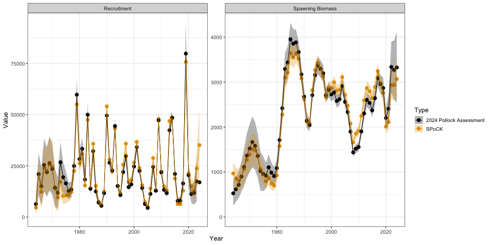
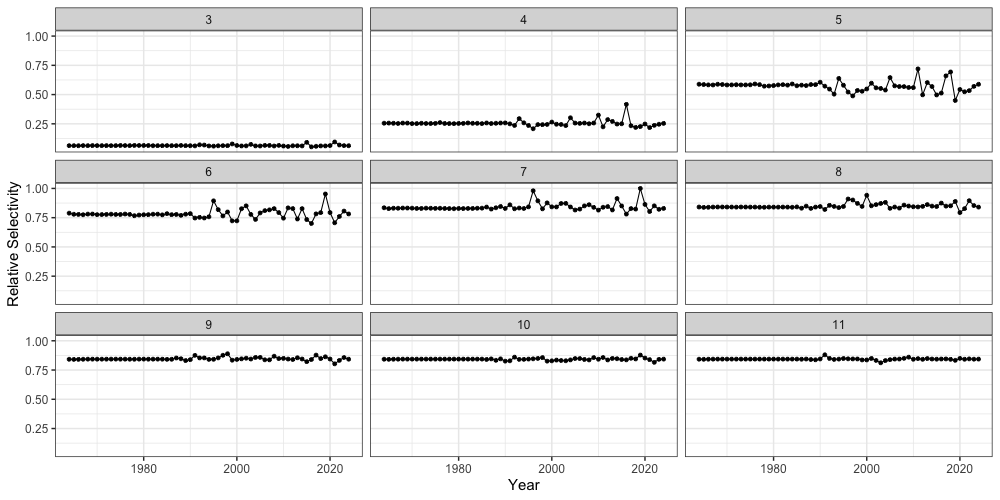

```{r, include = FALSE}
knitr::opts_chunk$set(
  collapse = TRUE,
  comment = "#>"
)
```

To further demonstrate additional funcionality of `SPoRC`, we will use the 2024 eastern Bering Sea walleye pollock assessment as an example. In particular, this vignette attempts to mimic the 2024 assessment. However, given the complexity and intricacies of the pollock assessment, a direct match in estimates is not currently possible due to a variety of factors, including:

1. The pollock assessment fits to the bottom trawl survey with a covariance matrix, which is currently not possible in `SPoRC`,
2. The bottom trawl survey follows a random walk process on logistic selectivity parameters, but also allows for age-1 deviations on the logistic functional form. This functionality is not incorporated in `SPoRC`,
3. Different weight-at-age matrices are utilized to fit to biomass indices, compute spawning biomass, and compute expected catches, which is not currently allowed. 

Despite these differences, `SPoRC` can generally approximate the dynamics of the 2024 assessment relatively closely. First, let us load in any necessary packages.

```{r setup, warning = FALSE, message = FALSE, eval = TRUE, warning = FALSE}
# Load in packages
library(SPoRC) 
library(here)
library(RTMB)
library(ggplot2)
library(dplyr)
data("sgl_rg_ebswp_data") # load in data
```

## Setup Model Dimensions

To initially set the model up, an input list containing a data list, parameter list, and a mapping list needs to be constructed. This is aided with the function `Setup_Mod_Dim`, where users specify a vector of years, ages, and lengths. Additionally, users need to specify the number of regions modelled (n_regions), number of sexes modeled (n_sexes), number of fishery fleets (n_fish_fleets), and number of survey fleets (n_srv_fleets)

```{r, eval = FALSE}
  input_list <- Setup_Mod_Dim(
    years = sgl_rg_ebswp_data$years,
    # vector of years
    ages = sgl_rg_ebswp_data$ages,
    # vector of ages
    lens = NA,
    # number of lengths
    n_regions = 1,
    # number of regions
    n_sexes = 1,
    # number of sexes
    n_fish_fleets = 1,
    # number of fishery fleets
    n_srv_fleets = 3 # number of survey fleets
  )
```

## Setup Recruitment Dynamics

Following the initialization of `input_list`, we can pass the created object into the next function (`Setup_Mod_Rec`) to parameterize recruitment dynamics. In the case of Bering Sea Pollock, recruitment is parameterized as such:

1) Beverton-Holt Recruitment, where steepness is fixed at the 2024 assessment estiamted value,
2) Recruitment deviations are estimated in a penalized likelihood framework,
3) Recruitment deviations are estimated for all years,
4) Initial age deviations have a `ln_sigmaR = 2`, while later deviations (after year 1) have a `ln_sigmaR = 1`. This is done to mimic the current assessment, where a different mean parameter is estimated for the early age deviations and later recruitment deviations,
5) Initial age deviations are estimated for all ages, including the plus group,
5) Initial age structure is derived by assuming a geometric series (`init_age_strc = 1`; the alternative is iterating age structure to some equilibrium `init_age_strc = 0`), and 
6) Individuals are assumed to spawn during March (`t_spawn = 0.25`)

```{r, eval = FALSE}

  inv_steepness <- function(s) qlogis((s - 0.2) / 0.8)

  input_list <- Setup_Mod_Rec(
    input_list = input_list,

    # Model options
    do_rec_bias_ramp = 0,
    # do bias ramp (0 == don't do bias ramp, 1 == do bias ramp)
    sigmaR_switch = 1,
    # when to switch from early to late sigmaR (switch in first year)
    ln_sigmaR = log(c(2, 1)),
    # Starting values for early and late sigmaR
    rec_model = "bh_rec",
    # recruitment model
    steepness_h = inv_steepness(0.623013),
    h_spec = "fix",
    # fixing steepness
    sigmaR_spec = "fix",
    # fix early sigmaR and late sigmaR
    sexratio = as.vector(c(1.0)),
    # recruitment sex ratio
    init_age_strc = 1,
    ln_global_R0 = 10,
    t_spawn = 0.25,
    equil_init_age_strc = 2
    # starting value for r0
  )
```


# Setup Biological Dynamics

Passing on the `input_list` that was updated in the previous helper function, we can then parameterize the biological dynamics of the model. The `Setup_Mod_Biologicals` requires data inputs for weight-at-age (`WAA`) and maturity-at-age (`MatAA`), both of which are dimensioned by `n_regions`, `n_years`, `n_ages`, `n_sexes`. In the case of Bering Sea pollock, natural mortality is age-specific and fixed. Thus, a natural mortality array is constructed and passed into the function, which is also dimensioned by `n_regions`, `n_years`, `n_ages`, `n_sexes`.

```{r, eval = FALSE}

  # Setup a fixed natural mortality array for use
  fix_natmort <- array(0, dim = c(input_list$data$n_regions, length(input_list$data$years), length(input_list$data$ages), 1))
  fix_natmort[,,1,] <- 0.9 # age 1 M
  fix_natmort[,,2,] <- 0.45 # age 2 M
  fix_natmort[,,-c(1,2),] <- 0.3 # age 3+ M
  
  input_list <- Setup_Mod_Biologicals(
    input_list = input_list,

    # Data inputs
    WAA = sgl_rg_ebswp_data$WAA,
    MatAA = sgl_rg_ebswp_data$MatAA,

    # Model options
    # mean and sd for M prior
    fit_lengths = 0,
    # don't fit length compositions
    M_spec = "fix",
    # fixing natural mortality
    Fixed_natmort = fix_natmort
  )
  
```

# Setup Movement and Tagging
Given that this vignette demonstrates a single-region model, no movement dynamics are specified. However, users will still need to define how movement dynamics are parameterized. In this case, the following code chunk specifies that movement is not estimated (`use_fixed_movement = 1`), movement is an identity matrix (`Fixed_Movement = NA`), and recruits do not move (`do_recruits_move = 0`). Specification of tagging dynamics will follow a similar fashion since this is a single-region model. All that is necessary is updating the `input_list` and setting the `UseTagging` argument to a value of 0. 

```{r, eval = FALSE}

# setup movement
  input_list <- Setup_Mod_Movement(
    input_list = input_list,
    use_fixed_movement = 1,
    Fixed_Movement = NA,
    do_recruits_move = 0
  )

# setup tagging
  input_list <- Setup_Mod_Tagging(
    input_list = input_list, 
    UseTagging = 0)
```

# Setup Catch and Fishing Mortality
Following the parameterization of biological dynamics, fishery dynamics can then be specified and set up using the `Setup_Mod_Catch_and_F` function. Again, the input_list that gets updated from previous helper functions. Users will need to supply the function with an array of observed catches `ObsCatch`, which are dimensioned as `n_regions`, `n_years`, and `n_fish_fleets`. Similarly, users will also need to specify the catch type of these observations with the `Catch_Type` argument. This argument expects a matrix dimensioned by `n_years` and `n_fish_fleets`, and is really only applicable in a spatial model (values of 0 indicate that catch is aggregated across regions in some periods and fleets, while values of 1 indicate catch is specific to each region in all periods and fleets). Thus, in a single region model, values of `1` should always be supplied. The function also expects the `UseCatch` argument to be specified, which is dimensioned as `n_regions`, `n_years`, and `n_fish_fleets`. Essentially, users will need to fill out whether catch is fit to for those particular partitions. Most use cases of this argument are scenarios in which catch is observed to be a value of 0, where the helper function automatically turns off the estimation of fishing mortality deviations for those partitions. Additional model options specified for this case study include whether fishing mortality penalties are utilized to help estimate deviations `Use_F_pen = 1`, and the `ln_sigmaC` values to fix at.

```{r, eval = FALSE}
  input_list <- Setup_Mod_Catch_and_F(
    input_list = input_list,

    # Data inputs
    ObsCatch = sgl_rg_ebswp_data$ObsCatch,
    Catch_Type = sgl_rg_ebswp_data$Catch_Type,
    UseCatch = sgl_rg_ebswp_data$UseCatch,

    # Model options
    Use_F_pen = 1,
    # whether to use f penalty, == 0 don't use, == 1 use
    sigmaC_spec = "fix",
    # fixing catch standard deviation
    ln_sigmaC = matrix(log(0.05), 1, 1)
    # starting / fixed value for catch standard deviation
  )
```

# Setup Fishery Indices and Compositions

To set up fishery indices and composition data, we will supply arrays of fishery indices and their associated standard errors (`ObsFishIdx` and `ObsFishIdx_SE`), which are dimensioned by by `n_regions`, `n_years`, `n_fish_fleets`. Additionally, we will supply both fishery age composition data and length composition data. Both `ObsFishAgeComps` and `ObsFishLenComps` are dimensioned by `n_regions`, `n_years`, `n_bins (n_ages | n_lens)`, `n_sexes`, `n_fish_fleets`. Because the Bering Sea pollock model does not fit to length composition data, `ObsFishLenComps` is specified at `NA` and `UseFishLenComps` is specified with 0s. Additionally, we specify that the fishery index is biomass-based, multinomial likelihoods are utilized for age composition data, and fishery age compositions are aggregatted across regions and sexes (because this is a single-region single-sex model).

```{r, eval = FALSE}
input_list <- Setup_Mod_FishIdx_and_Comps(
    input_list = input_list,
    # data inputs
    ObsFishIdx = sgl_rg_ebswp_data$ObsFishIdx,
    ObsFishIdx_SE = sgl_rg_ebswp_data$ObsFishIdx_SE,
    UseFishIdx = sgl_rg_ebswp_data$UseFishIdx,
    ObsFishAgeComps = sgl_rg_ebswp_data$ObsFishAgeComps,
    UseFishAgeComps = sgl_rg_ebswp_data$UseFishAgeComps,
    ISS_FishAgeComps = sgl_rg_ebswp_data$ISS_FishAgeComps,
    ObsFishLenComps = array(NA_real_, dim = c(1, length(input_list$data$years), length(input_list$data$lens), 1, 1)),
    UseFishLenComps = array(0, dim = c(1, length(input_list$data$years), 1)),

    # Model options
    fish_idx_type = c("biom"),
    # indices for fishery
    FishAgeComps_LikeType = c("Multinomial"),
    # age comp likelihoods for fishery fleet
    FishLenComps_LikeType = c("none"),
    # length comp likelihoods for fishery
    FishAgeComps_Type = c("agg_Year_1-terminal_Fleet_1"),
    # age comp structure for fishery
    FishLenComps_Type = c("none_Year_1-terminal_Fleet_1"),
    # length comp structure for fishery
    FishAge_comp_agg_type = c(1),
    # ADMB aggregation quirks, ideally get rid of this
    FishLen_comp_agg_type = c(0)
    # ADMB aggregation quirks, ideally get rid of this
  )
```

# Setup Survey Indices and Compositions

Setting up survey indices and compositions follows a similar fashion. Here, will supply arrays of survey indices and their associated standard errors (`ObsSrvIdx` and `ObsSrvIdx_SE`), which are dimensioned by by `n_regions`, `n_years`, `n_srv_fleets`. In this case, we are modelling three survey fleets, where fleet 1 is the bottom trawl survey, fleet 2 is the acoustic trawl survey, and fleet 3 is the acoustic vessel of opportunity survey. We will also input both survey age composition data and length composition data. Both `ObsSrvAgeComps` and `ObsSrvLenComps` are dimensioned by `n_regions`, `n_years`, `n_bins (n_ages | n_lens)`, `n_sexes`, `n_srv_fleets`. All three survey indices are biomass-based and multinomial likelihoods are used to fit to age-compositions for fleets 1 and 2. However, because the acoustic vessel of oppurtunity survey does not have composition data, these are not fit to (and hence specified at none).

```{r, eval = FALSE}
  # Setup survey indices and compositions
  input_list <- Setup_Mod_SrvIdx_and_Comps(
    input_list = input_list,

    # data inputs
    ObsSrvIdx = sgl_rg_ebswp_data$ObsSrvIdx,
    ObsSrvIdx_SE = sgl_rg_ebswp_data$ObsSrvIdx_SE,
    UseSrvIdx = sgl_rg_ebswp_data$UseSrvIdx,
    ObsSrvAgeComps = sgl_rg_ebswp_data$ObsSrvAgeComps,
    ISS_SrvAgeComps = sgl_rg_ebswp_data$ISS_SrvAgeComps,
    UseSrvAgeComps = sgl_rg_ebswp_data$UseSrvAgeComps,
    ObsSrvLenComps = array(NA_real_, dim = c(1, length(input_list$data$years), length(input_list$data$lens), 1, 3)),
    UseSrvLenComps = array(0, dim = c(1, length(input_list$data$years), 3)),
    ISS_SrvLenComps = NULL,

    # Model options
    srv_idx_type = c("biom", "biom", "biom"),
    # abundance and biomass for survey fleet 1, 2, and 3
    SrvAgeComps_LikeType = c("Multinomial", "Multinomial", "none"),
    # survey age composition likelihood for survey fleet 1, 2, and 3
    SrvLenComps_LikeType = c("none", "none", "none"),
    #  survey length composition likelihood for survey fleet 1, 2, and 3
    SrvAgeComps_Type = c(
      "agg_Year_1-terminal_Fleet_1",
      "agg_Year_1-terminal_Fleet_2",
      "none_Year_1-terminal_Fleet_3"
    ),
    # survey age comp type

    SrvLenComps_Type = c(
      "none_Year_1-terminal_Fleet_1",
      "none_Year_1-terminal_Fleet_2",
      "none_Year_1-terminal_Fleet_3"
    ),
    # survey length comp type

    SrvAge_comp_agg_type = c(1, 1, 1),
    # ADMB aggregation quirks, ideally get rid of this
    SrvLen_comp_agg_type = c(0, 0, 0)
    # ADMB aggregation quirks, ideally get rid of this
  )
```

# Setting up Fishery Selectivity and Catchability
Fishery selectivity is specified to vary semi-parametrically for the pollock model, with the `2dar1` option specified. Here, we will estiamte selectivity deviations in a penalized framework and fix variance values a priori `fishsel_pe_pars_spec = "fix"`. Moreover, we will estiamte fishery selectivity deviations for all dimensions, and specify correlations to be set at 0 (`corr_opt_semipar = "corr_zero_y_a_c"`). Thus, semi-parametric deviations collapse to a simple iid formulation. Additionally, we specify that the underlying selectivity form for the fishery is a logistic function. Lastly, a single catchability term is estimated to fit to the early fishery index utilized in the model (`fish_q_spec = c("est_all")`). In the `Fit Model` section, we will demonstrate how variance parameters can be fixed to allow for estimation in a penalized likelihood framework. 

```{r, eval = F}
  # Setup fishery selectivity and catchability
  input_list <- Setup_Mod_Fishsel_and_Q(

    input_list = input_list,

    # Model options
    # fishery selectivity, whether continuous time-varying
    cont_tv_fish_sel = c("2dar1_Fleet_1"),
    fishsel_pe_pars_spec = "fix", # doing penalized likelihood for selex devs
    fish_sel_devs_spec = "est_all", # estimating all sel devs
    corr_opt_semipar = "corr_zero_y_a_c", # making sure 2d correaltions are 0, collapses to a simple iid case
    # fishery selectivity blocks
    fish_sel_blocks = c("none_Fleet_1"),
    # fishery selectivity form
    fish_sel_model = c("logist1_Fleet_1"),
    # fishery catchability blocks
    fish_q_blocks = c("none_Fleet_1"),
    # whether to estiamte all fixed effects for fishery selectivity
    fish_fixed_sel_pars = c("est_all"),
    # whether to estiamte all fixed effects for fishery catchability
    fish_q_spec = c("est_all")
  )
```

# Setting up Survey Selectivity and Catchability
Survey selectivity is setup in a similar way. Here, we specify that the first survey fleet has `iid` parametric deviations on a selectivity form, while the second survey fleet has `2dar1` semi-parametric deviations. Selectivity for survey fleet 3 is not estimated as no age composition data are available. Therefore, selectivity from survey fleet 2 and 3 are shared. Again, we specify that selectivity deviations are estimated in a penalized likelihood framework with the argument `srvsel_pe_pars_spec = c("fix", "fix", "fix")` and specify to set `2dar1` correlations at 0, such that semi-parametric deviations collapse to an iid formulation (`corr_opt_semipar = c(NA, "corr_zero_y_a_c", "corr_zero_y_a_c")`).

```{r, eval = F}
 # Setup survey selectivity and catchability
  input_list <- Setup_Mod_Srvsel_and_Q(
    input_list = input_list,

    # Model options
    # survey selectivity, whether continuous time-varying
    cont_tv_srv_sel = c("iid_Fleet_1", "2dar1_Fleet_2", "2dar1_Fleet_3"),
    srvsel_pe_pars_spec = c("fix", "fix", "fix"), # penalize survey selex devs
    srv_sel_devs_spec = c("est_all", "est_all", "none"), # estimating all srv selex devs
    corr_opt_semipar = c(NA, "corr_zero_y_a_c", "corr_zero_y_a_c"), # setting corelations at 0, so 2dar1 collapses to simple iid semi-parametric devs

    # survey selectivity blocks
    srv_sel_blocks = c("none_Fleet_1", "none_Fleet_2", "none_Fleet_3"),
    # survey selectivity form
    srv_sel_model = c(
      "logist1_Fleet_1",
      "logist1_Fleet_2",
      "logist1_Fleet_3"
    ),
    # survey catchability blocks
    srv_q_blocks = c("none_Fleet_1", "none_Fleet_2", "none_Fleet_3"),
    # whether to estiamte all fixed effects for survey selectivity
    srv_fixed_sel_pars_spec = c("est_all", "est_all", "est_all"),
    # whether to estiamte all fixed effects for survey catchability
    srv_q_spec = c("est_all", "est_all", "est_all")
  )

  # note that AVO (fleet 3) does not have any comp data, and needs to share selectivity with ATS (fleet 2)
  input_list$map$ln_srv_fixed_sel_pars <- factor(c(1, 2, 3, 4, 3, 4))

  # share ATS and AVO selex devs
  map_srvsel_devs[,,,,3] <- map_srvsel_devs[,,,,2]
  input_list$map$ln_srvsel_devs <- factor(map_srvsel_devs)
```

# Setup Model Weighting

We will then set up how data should be weighted with $\lambda$ in this model. Here, all $\lambda$ values are set at 1 and TMB likelihoods are utilized. Thus, all data sources are weighted either using specified input sample sizes (for composition data) or specified variances (catch and abundance indices). 
```{r, eval = FALSE}
input_list <- Setup_Mod_Weighting(
  input_list = input_list,
  sablefish_ADMB = 0,
  likelihoods = 1, # using TMB likelihoods
  Wt_Catch = 1,
  Wt_FishIdx = 1,
  Wt_SrvIdx = 1,
  Wt_Rec = 1,
  Wt_F = 1,
  Wt_Tagging = 0,
  Wt_FishAgeComps = array(1, dim = c(input_list$data$n_regions,
                                     length(input_list$data$years),
                                     input_list$data$n_sexes,
                                     input_list$data$n_srv_fleets)),
  Wt_FishLenComps = array(1, dim = c(input_list$data$n_regions,
                                     length(input_list$data$years),
                                     input_list$data$n_sexes,
                                     input_list$data$n_srv_fleets)),
  Wt_SrvAgeComps = array(1, dim = c(input_list$data$n_regions,
                                    length(input_list$data$years),
                                    input_list$data$n_sexes,
                                    input_list$data$n_srv_fleets)),
  Wt_SrvLenComps = array(1, dim = c(input_list$data$n_regions,
                                    length(input_list$data$years),
                                    input_list$data$n_sexes,
                                    input_list$data$n_srv_fleets))
)
```

# Fit Model and Plot

Next, we can extract out elements created from the `input_list` object. We will then specify the values to fix selectivity variances at. In the first case, the fishery selectivity variance is fixed at a value of 0.075 In the second case, the bottom trawl survey `a50` and `k` selectivity variances for a logistic function are fixed at 0.075 Lastly, the acoustic trawl and vessel of opportunity surveys will have a specified variance of 0.15. For further details on the dimensionality of `fishsel_pe_pars` and `srvsel_pe_pars`, please refer to the `Description of Model Parameters` page. 

```{r Fit Model, message = FALSE,  eval = FALSE}
# extract out lists updated with helper functions
data <- input_list$data
parameters <- input_list$par
mapping <- input_list$map

# selex sigma to fix at, given penalized likelihood
parameters$fishsel_pe_pars[,4,,] <- log(0.075) # fishery selex variance
parameters$srvsel_pe_pars[,1:2,,1] <- log(0.075) # survey BTS - a50 and delta variance
parameters$srvsel_pe_pars[,4,,2] <- log(0.15) # survey ATS and ato variance

# Fit model
ebswp_rtmb_model <- fit_model(data,
                              parameters,
                              mapping,
                              random = NULL,
                              newton_loops = 3,
                              silent = TRUE
                              )

# Get standard error report
ebswp_rtmb_model$sd_rep <- RTMB::sdreport(ebswp_rtmb_model)
```

Next, we can extract out parameter estimates of recruitment and spawning biomass and compare to the 2024 pollock model. 
```{r Compare Models, eval = F}
# Get recruitment
rec_series <- reshape2::melt((ebswp_rtmb_model$rep$Rec)) %>%
  mutate(se = ebswp_rtmb_model$sdrep$sd[names(ebswp_rtmb_model$sdrep$value) == 'Rec'])
rec_series$Par <- "Recruitment"

# Get SSB time-series
ssb_series <- reshape2::melt((ebswp_rtmb_model$rep$SSB)) %>%
  mutate(se = ebswp_rtmb_model$sdrep$sd[names(ebswp_rtmb_model$sdrep$value) == 'SSB'])
ssb_series$Par <- "Spawning Biomass"

# bind together
ts_df <- rbind(ssb_series,rec_series) %>%
  dplyr::rename(Region = Var1, Year = Var2) %>%
  dplyr::mutate(Year = Year + 1963, type = 'SPoRC')

# Get actual assessment results
ssb_ass <- data.frame(
  Region = 1,
  Year = 1964:2024,
  value = sgl_rg_ebswp_data$SSB[,2],
  se = sgl_rg_ebswp_data$SSB[,3],
  Par = 'Spawning Biomass',
  type = '2024 Pollock Assessment'
)

# recruitment
rec_ass <- data.frame(
  Region = 1,
  Year = 1964:2024,
  value = sgl_rg_ebswp_data$R[,2],
  se = sgl_rg_ebswp_data$R[,3],
  Par = 'Recruitment',
  type = '2024 Pollock Assessment'
)

# bind
ts_df <- ts_df %>% bind_rows(ssb_ass, rec_ass)
```

In general, we see that the trends in recruitment and spawning stock biomass align relatively well. However, there are some slight discrepancies between these estimates, likely due to the factors discussed at the start of this vignette. 
```{r Plot Absolute, eval = F}
ggplot(ts_df, aes(x = Year, y = value, ymin = value - (1.96 * se),
                  ymax = value + (1.96 * se), color = type, fill = type)) +
  geom_point(size = 3) +
  geom_line() +
  facet_wrap(~Par, scales = 'free') +
  geom_ribbon(alpha = 0.3, color = NA) +
  ggthemes::scale_color_colorblind() +
  ggthemes::scale_fill_colorblind() +
  labs(y = "Value")  +
  theme_bw(base_size = 13) +
  ylim(0, NA) +
  labs(x = 'Year', y = 'Value', color = 'Type', fill = 'Type')
```



Lastly, we can also inspect estimates of fishery selectivity from `SPoRC`. Here, we show relative selectivity estimates for ages 3 - 11 (panels). Note that selectivity in this model can exceed 1, and we normalize these values in the figure to improve interpretability 
```{r, eval = F}
reshape2::melt(ebswp_rtmb_model$rep$fish_sel) %>%
  mutate(value = value/max(value)) %>%
  rename(Region = Var1, Year = Var2, Age = Var3, Sex = Var4, Fleet = Var5) %>%
  filter(Age %in% 3:11) %>%
  ggplot(aes(x = Year + 1963, y = value)) +
  geom_point() +
  geom_line() +
  facet_wrap(~Age) +
  theme_bw(base_size = 15) +
  labs(x = 'Year', y = 'Relative Selectivity')
```


