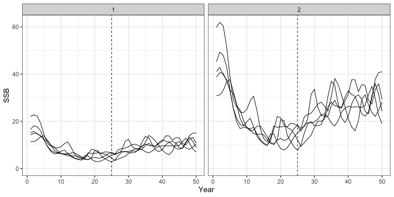

```{r, include = FALSE}
knitr::opts_chunk$set(
  collapse = TRUE,
  comment = "#>"
)
```

In addition to being an estimation model, `SPoCK` also has the capacity to conduct closed loop simulations to evaluate the impacts of estimation model assumptions and harvest strategies on different operating models. These closed loop simulations can be conducted on either spatially-explicit or panmicitic populations. In this vignette, we will demonstrate how a spatially-explicit closed-loop simulation by outlining the following steps:

1. Define an operating model (the truth),
2. Define an estimation model to use in the closed-loop simulation,
3. Setup the simulation loop to run an operating and estimation model,
4. Derive reference points and management advice using estimates from the estimation model, and
5. Return management advice back into the annual cycle, completing the closed loop simulation.

Let us first load in the `SPoCK` package.

```{r setup, eval = FALSE}
library(SPoCK)
library(ggplot2)
```

# Define Operating Model
We can then define an operating model we want to condition a population on. Parameter estimates used here are purely hypothetical and generally represents a short-lived species. Operating model simulation can be defined with the following code:

```{r, eval = FALSE}
# Set up model dimensions
sim_list <- Setup_Sim_Dim(n_sims = 5, # number of simulations to conduct
                          n_yrs = 50, # number of years
                          n_regions = 2, # number of regions
                          n_ages = 8, # number of ages
                          n_sexes = 1, # number of sexes
                          n_fish_fleets = 1, # number of fishery fleets
                          n_srv_fleets = 1, # number of survey fleets
                          run_feedback = T, # specifies whether to run this as a closed-loop
                          feedback_start_yr = 25 # when the closed loop starts
                          )
```

We can then create a variety of simulation objects to store results in:
```{r, eval = FALSE}
# set up containers
sim_list <- Setup_Sim_Containers(sim_list)
```

Initial values for fishing mortality need to then be supplied. In this case, an array `Fmort` gets populated with values according to the specified fishing mortality patterns, and the remaining values following `feedback_start_yr = 25` are left as zeros, which will be populated in the closed-loop simulation. 
```{r, eval = FALSE}
# Setup fishing mortality
sim_list <- Setup_Sim_FishMort(sim_list = sim_list, # simulation list defined from above
                               sigmaC = 1e-3, # observation error for catch
                               init_F_vals = matrix(0, nrow = sim_list$n_regions, ncol = sim_list$n_fish_fleets), # initial F values to impose on initial age structure
                               Fmort_pattern = matrix(c('one-way', "one-way"), nrow = sim_list$n_regions, ncol = sim_list$n_fish_fleets), # fishing mortality pattern
                               Fmort_start = matrix(c(0.01, 0.01), nrow = sim_list$n_regions, ncol = sim_list$n_fish_fleets), # start value of fishing mortality
                               Fmort_fct = matrix(c(50, 50), nrow = sim_list$n_regions, ncol = sim_list$n_fish_fleets), # factor to multiply fmort_start by to reach apicial F
                               proc_error = FALSE, # whether or not to have fishing mortality process error
                               proc_error_sd = 0 # process error on fishing mortality
)
```

Fishery selectivity dynamics can then be specified with the following function:
```{r, eval = FALSE}
sim_list <- Setup_Sim_FishSel(sel_model = matrix(c('logistic', "logistic"), nrow = sim_list$n_regions, ncol = sim_list$n_fish_fleets), # selex model
                              # a50, k for logistic shared across regions
                              fixed_fish_sel_pars = array(c(3,3,1,1), dim = c(sim_list$n_regions, sim_list$n_sexes, sim_list$n_fish_fleets, 2)),
                              sim_list = sim_list # simulation list from previous code chunk
)
```

Similarly, survey dynamics can be defined, where a user can define the observation error of the survey, survey catchability, and survey selectivity:
```{r, eval = FALSE}
sim_list <- Setup_Sim_Survey(sim_list = sim_list,
                             sigmaSrvIdx = array(0.05, dim = c(sim_list$n_regions, sim_list$n_srv_fleets)), # survey observation error
                             base_srv_q = array(1, dim = c(sim_list$n_regions, sim_list$n_srv_fleets)), # base survey catchability value
                             srv_q_pattern = matrix(c('constant', "constant"), nrow = sim_list$n_regions, ncol = sim_list$n_srv_fleets), # catchability pattern
                             sel_model = matrix(c('logistic', "logistic"), nrow = sim_list$n_regions, ncol = sim_list$n_srv_fleets), # selectivity model
                             # a50, k, for logistic shared across regions
                             fixed_srv_sel_pars = array(c(3,3,1,1), dim = c(sim_list$n_regions, sim_list$n_sexes, sim_list$n_srv_fleets, 2))
)
```

Recruitment dynamics can be defined with the code chunk below, where various options are available, including whether recruits move, the recruitment sex-ratio, recruitment parameters and recruitment functional forms, as well as whether recruitment occurs globally or locally (only applicable in a spatial context). Here, region 1 is assumed to be more productive than region 2.
```{r, eval = FALSE}
# Setup recruitment stuff
sim_list <- Setup_Sim_Rec(
  sim_list = sim_list,
  do_recruits_move = "dont_move", # == 0, recruits don't move , == 1 recruits move
  base_rec_sexratio = 1, # single sex
  rec_sexratio_vary = "constant", # sex ratio type
  base_r0 = c(100, 50),
  r0_vary = "constant", # R0 type
  base_h = c(0.8, 0.8), # base steepness values
  init_sigmaR = 0.5, # inital deviations variability
  sigmaR = 0.5, # sigma R
  recruitment_opt = "bh_rec", # recruitment option
  rec_dd = "global", # recruitment deviations density dependence
  init_dd = "global", # initial age deviations density dependence
  rec_lag = 1 # recruitment ssb lag
)

```

Biological features of the population can then be defined with the code chunk below, with ability to define natural mortality values, weight-at-age, maturity-at-age, and patterns for these biological dynamics.
```{r, eval = FALSE}
sim_list <- Setup_Sim_Biologicals(
  sim_list = sim_list,
  base_M_value = array(0.5, dim = c(sim_list$n_regions, sim_list$n_ages, sim_list$n_sims)), # base M value
  M_pattern = "constant", # M pattern
  base_WAA_values = array(rep(5 / (1 + exp(-1 * (1:sim_list$n_ages - 5))), each = sim_list$n_regions * sim_list$n_sexes),
                          dim = c(sim_list$n_regions, sim_list$n_ages, sim_list$n_sexes)), # weight-at-age values
  WAA_pattern = "constant", # weight-at-age patterns
  base_Maturity_AA_values = array(rep(1 / (1 + exp(-2 * (1:sim_list$n_ages - 5))), each = sim_list$n_regions * sim_list$n_sexes),
                                  dim = c(sim_list$n_regions, sim_list$n_ages, sim_list$n_sexes)), # matrutiy at age values
  Maturity_AA_pattern = "constant" # maturity at age patterns
)
```

Because movement dynamics can be incredibly complex, we have designed it such that users supply their own defined movement "matrix". This matrix then needs to be input into the `sim_list` object for use. Here, we are defining movement such that individuals move from the more productive region (region 1) to the less  
```{r, eval = FALSE}
ref <- 1
movement_matrix <- array(0, dim = c(sim_list$n_regions, sim_list$n_regions, sim_list$n_yrs, sim_list$n_ages, sim_list$n_sexes, sim_list$n_sims)) # From, To
base <- matrix(c(0, 1), sim_list$n_regions, sim_list$n_regions, byrow = TRUE)

# Plug in movement process error
for(sim in 1:sim_list$n_sims) {
  for(a in 1:sim_list$n_ages) {
    for(s in 1:sim_list$n_sexes) {
      for(y in 1:sim_list$n_yrs) {
        for(r in 1:sim_list$n_regions) {
          tmp_move <- base[r,]
          tmp_move[-ref] <- tmp_move[-ref]
          movement_matrix[r,,y,a,s,sim] <- exp(tmp_move) / sum(exp(tmp_move))
        } # end r loop
      } # end y loop
    } # end s loop
  } # end a loop
} # end sim loop

sim_list$movement_matrix <- movement_matrix
```

Lastly, observation processes need to be defined for the simulation, which includes observations for tagging data, survey indices, fishery and survey age compositions. This is done with the following functions:
```{r, eval = FALSE}
sim_list <- Setup_Sim_Tagging(
  sim_list = sim_list,
  n_tags = 5000, # number of total tags to release in a year
  max_liberty = 30, # maximum number of years to track a cohort
  tag_years = seq(1, sim_list$n_yrs, 1), # number of years tagging occurs
  t_tagging = 0.5, # time of tagging
  base_Tag_Reporting = c(0.2, 0.2), # base tag reporting rates
  Tag_Reporting_pattern = "constant", # tag reporting rate pattern
  Tag_Ind_Mort = 0, # initial tag induced mortality
  Tag_Shed = 0 # chronic tag shedding
)

# Setup observation processes
sim_list <- Setup_Sim_Observation_Proc(
  sim_list = sim_list,
  Comp_Structure = "spltR_jntS", # how compositions should be structured
  Comp_Srv_Like = "Multinomial", # survey comp likelihood
  Comp_Fish_Like = "Multinomial", # fishery comp likelihood
  ISS_FishAge_Pattern = 'constant', # input sample size pattern (should be constant in closed loop)
  FishAgeTheta = NA, # optional parameters for dirichlet-multinomial
  SrvAgeTheta = NA, # optional parameters for dirichlet-multinomial
  Srv_Like_Pars = NA, # optional parameters for dirichlet-multinomial
  base_ISS_FishAge = 500, # base sample size for fishery ages
  base_ISS_SrvAge = 500, # base sample size for survey ages
  Tag_Like = "Poisson", # tag likelihood
  Tag_Like_Pars = NA # tag likelihood parameters
)
```

All operating model specifications are now saved in `sim_list`, which can then be later used within the closed-loop simulation. Following the operating model specification, we can then define what we want our estimation model to be. For demonstration purposes, we will be directly mimicking the operating model specification (a self-test).

# Define Estimation Model
To define the estimation model, we will be creating skeleton data, parameter, and mapping lists using the maximum number of years in the simulation (int this case, this is specified as 100), which will get truncated each year up until the total number of simulation years using the `Get_Feedback_Data` function. Note that in all the specifications described below, almost all data objects are specified either as 0s or NAs. These will get replaced later on, using the `Get_Feedback_Data` function. Again, we will first set up the general model dimensions:
```{r, eval = FALSE}
# Initialize model dimensions and data list
input_list <- Setup_Mod_Dim(years = 1:sim_list$n_yrs, # vector of years
                            ages = 1:sim_list$n_ages, # vector of ages
                            lens = 1, # number of lengths
                            n_regions = sim_list$n_regions, # number of regions
                            n_sexes = sim_list$n_sexes, # number of sexes
                            n_fish_fleets = sim_list$n_fish_fleets, # number of fishery fleet
                            n_srv_fleets = sim_list$n_srv_fleets, # number of survey fleets
                            verbose = F # whether or not to return messages
                            )
```

We can then setup our modeled recruitment dynamics. Here, we will be specifying a Beverton-Holt stock recruitment function, with global density-dependence. Moreover, we will be fixing steepness at the values specified for the operating model.
```{r, eval = FALSE}
# helper to define steepness starting values
inv_steepness <- function(s) qlogis((s - 0.2) / 0.8)

# Setup recruitment stuff (using defaults for other stuff)
input_list <- Setup_Mod_Rec(input_list = input_list, # input data list from above
                            # Model options
                            ln_sigmaR = log(c(0.5, 0.5)), # sigmaR for model
                            rec_model = "bh_rec", # recruitment model
                            sigmaR_spec = "fix", # fix sigmaR
                            InitDevs_spec = "est_shared_r", # estimated global initial deviations
                            RecDevs_spec = "est_shared_r", # estimate global recruitment deviations
                            rec_dd = "global", # global recruitment density dependence
                            rec_lag = 1, # recruitment ssb lag
                            h_spec = "fix", # fixing steepness
                            steepness_h = inv_steepness(c(0.8, 0.8)) # steepness values in bounded logit space
                            )
```

Biological values are similarly specified at the same values defined for the operating model with the following function. Here, weight-at-age and maturity-at-age are fixed at the true values, while natural mortality is freely estimated. 
```{r, eval = FALSE}
input_list <- Setup_Mod_Biologicals(input_list = input_list,
                                    WAA = array(NA, dim = c(input_list$data$n_regions, length(input_list$data$years), length(input_list$data$ages), input_list$data$n_sexes)), # weight at age 
                                    MatAA = array(NA, dim = c(input_list$data$n_regions, length(input_list$data$years), length(input_list$data$ages))), # maturity at age input_list$data$n_sexes)),
                                    ln_M = log(0.5) # natural mortality value
                                    )

```

We will also estimate movement, given that tagging data are simulated. Movement here is specified to be constant across ages, years, and sexes. 
```{r, eval = FALSE}
input_list <- Setup_Mod_Movement(input_list = input_list,
                                 # Model options
                                 Movement_ageblk_spec = 'constant', # constant age movement
                                 Movement_yearblk_spec = 'constant', # constant year movement
                                 Movement_sexblk_spec = "constant", # constant sex movement
                                 do_recruits_move = 0, # recruits dont move
                                 cont_vary_movement = 'none' # no continously varying movement
                                 )
```

Fishery and survey data, along with associated observation processes then need to be specified. This includes catch and composition data. **Note that for both fishery and survey composition data, an input sample size is provided and is not left as NA or 0s**. 
```{r, eval = FALSE}
input_list <- Setup_Mod_Catch_and_F(input_list = input_list,
                                    ObsCatch = array(NA, dim = c(input_list$data$n_regions, length(input_list$data$years), input_list$data$n_fish_fleets)), # observed catches
                                    Catch_Type = array(1, dim = c(length(input_list$data$years), input_list$data$n_fish_fleets)), # catch type
                                    UseCatch = array(1, dim = c(input_list$data$n_regions, length(input_list$data$years), input_list$data$n_fish_fleets)), # whether catch is used

                                    # Model options
                                    sigmaC_spec = 'fix', # sigma catch specification
                                    sigmaF_spec = "fix" # sigma for F specification
)

# Setup fishery indices and compositions
input_list <- Setup_Mod_FishIdx_and_Comps(input_list = input_list,
                                          ObsFishIdx = array(NA, c(input_list$data$n_regions, length(input_list$data$years), input_list$data$n_fish_fleets)), # fishery index (not used)
                                          ObsFishIdx_SE = array(NA, c(input_list$data$n_regions, length(input_list$data$years), input_list$data$n_fish_fleets)), # fishery index SE (not used)
                                          UseFishIdx = array(0, c(input_list$data$n_regions, length(input_list$data$years), input_list$data$n_fish_fleets)), # whether fishery index is used
                                          ObsFishAgeComps = array(NA, dim = c(input_list$data$n_regions, length(input_list$data$years), length(input_list$data$ages), input_list$data$n_sexes, input_list$data$n_fish_fleets)), # observed fishery age comps
                                          UseFishAgeComps = array(1, dim = c(input_list$data$n_regions, length(input_list$data$years), input_list$data$n_fish_fleets)), # whether fishery ages are used
                                          ObsFishLenComps = array(NA, dim = c(input_list$data$n_regions, length(input_list$data$years), length(input_list$data$lens), input_list$data$n_sexes, input_list$data$n_fish_fleets)), # observed fishery lengths
                                          UseFishLenComps = array(0, dim = c(input_list$data$n_regions, length(input_list$data$years), input_list$data$n_fish_fleets)), # whether fishery lengths are used
                                          ISS_FishAgeComps = array(500, dim = c(input_list$data$n_regions, length(input_list$data$years), input_list$data$n_sexes, input_list$data$n_fish_fleets)),
# fishery input sample size. NOTE: This is specified at 500, as in the OM, and is not left blank!

                                          # Model options
                                          fish_idx_type = "none", # fishery index type
                                          FishAgeComps_LikeType = "Multinomial", # composition likelihood
                                          FishLenComps_LikeType = "none", # composition likelihood
                                          FishAgeComps_Type =  "spltRjntS_Year_1-terminal_Fleet_1", # age composition type
                                          FishLenComps_Type =  "none_Year_1-terminal_Fleet_1" # length composition type
                                          )

# Setup survey indices and compositions
input_list <- Setup_Mod_SrvIdx_and_Comps(input_list = input_list,
                                         ObsSrvIdx = array(NA, dim = c(input_list$data$n_regions, length(input_list$data$years), input_list$data$n_srv_fleets)), # observed survey index
                                         ObsSrvIdx_SE = array(0.05, dim = c(input_list$data$n_regions, length(input_list$data$years), input_list$data$n_srv_fleets)), # observed susrvey index SE
                                         UseSrvIdx =  array(1, dim = c(input_list$data$n_regions, length(input_list$data$years), input_list$data$n_fish_fleets)), # whether survey indices are used
                                         ObsSrvAgeComps = array(NA,  dim = c(input_list$data$n_regions, length(input_list$data$years), length(input_list$data$ages), input_list$data$n_sexes, input_list$data$n_srv_fleets)), # observed survey ages
                                         UseSrvAgeComps = array(1, dim = c(input_list$data$n_regions, length(input_list$data$years), input_list$data$n_fish_fleets)), # whether survey ages are used
                                         ObsSrvLenComps = array(NA, dim = c(input_list$data$n_regions, length(input_list$data$years), length(input_list$data$lens), input_list$data$n_sexes, input_list$data$n_srv_fleets)), # survey length comps
                                         UseSrvLenComps = array(0, dim = c(input_list$data$n_regions, length(input_list$data$years), input_list$data$n_srv_fleets)), # whether survey lengths are used
                                         ISS_SrvAgeComps = array(500, dim = c(input_list$data$n_regions, length(input_list$data$years), input_list$data$n_sexes, input_list$data$n_srv_fleets)),
# survey input sample size. NOTE: This is specified at 500, as in the OM, and is not left blank!

                                         # Model options
                                         srv_idx_type = "abd", # survey index type
                                         SrvAgeComps_LikeType = "Multinomial", # composition likelihood
                                         SrvLenComps_LikeType = "none", # composition likelihood
                                         SrvAgeComps_Type = "spltRjntS_Year_1-terminal_Fleet_1", # age composition type
                                         SrvLenComps_Type = "none_Year_1-terminal_Fleet_1" # length composition type
                                         )
```

We are almost there! We then need to specify fishery and survey selectivity and catchability processes. In this case, a single fishery and survey fleet operates, where selectivity is specified as logistic for both the fishery and survey. Selectivity here is time-and spatially-invariant. Catchability is only estimated for the survey (since there isn't a fishery index simulated) and is also time- and spatially-invariant.
```{r, eval = FALSE}
# Setup fishery selectivity and catchability
input_list <- Setup_Mod_Fishsel_and_Q(input_list = input_list,
                                      # Model options
                                      cont_tv_fish_sel = "none_Fleet_1", # whether selex is continously varying
                                      fish_sel_blocks = "none_Fleet_1", # fishery selex blocks
                                      fish_sel_model = "logist1_Fleet_1", # fishery selex model
                                      fish_q_blocks = "none_Fleet_1", # fishery catchability blocks
                                      fish_fixed_sel_pars = "est_shared_r" # whether parameters are spatially varying
)

# Setup survey selectivity and catchability
input_list <- Setup_Mod_Srvsel_and_Q(input_list = input_list,
                                     cont_tv_srv_sel = "none_Fleet_1",  # whether selex is continously varying
                                     srv_sel_blocks = "none_Fleet_1", # survey selex blocks
                                     srv_sel_model = "logist1_Fleet_1", # survey selex model
                                     srv_q_blocks = "none_Fleet_1", # survey catchability blocks
                                     srv_fixed_sel_pars_spec = "est_shared_r", # whether parameters are spatially varying
                                     srv_q_spec = "est_shared_r" # estimate survey q, and spatially-invariant
                                     )
```

Observation processes for tagging data then need to be defined. Here, we are assuming a Poisson tag likelihood (as in the operating model), with constant tag reporting rates freely estimated. Note that the tag release indicator must be defined (indicates the tag cohort (rows), by tag region (first column), and tag release year (second column)).
```{r, eval = FALSE}
# Setup tagging stuff
input_list <- Setup_Mod_Tagging(input_list = input_list,
                                tag_release_indicator = as.matrix(sim_list$tag_rel_indicator), # tag release indicator (this MUST BE DEFINED!)
                                Tagged_Fish = array(NA, dim = c(dim(sim_list$Tag_Fish[1:nrow(as.matrix(sim_list$tag_rel_indicator)),,,1]), input_list$data$n_sexes)), # tagged fish
                                Obs_Tag_Recap = array(NA, dim = c(dim(sim_list$Obs_Tag_Recap[,1:nrow(as.matrix(sim_list$tag_rel_indicator)),,,,1]), input_list$data$n_sexes)), # tag recaptures

                                # Model options
                                UseTagging = 1, # whether tagging are used
                                t_tagging = 0.5, # time tagging occurs
                                max_tag_liberty = 30, # max tag liberty to track ohorts
                                Tag_LikeType = 'Poisson', # possion likelihood
                                tag_selex = "SexSp_DomFleet", # sex-specific and weighted sum of fleet selex
                                tag_natmort = "AgeSp_SexSp", # age and sex-specific natural mortailty
                                move_age_tag_pool = "all", # pooling all tag age data to fit
                                move_sex_tag_pool = "all", # pooling all sex data tp fit
                                Init_Tag_Mort_spec = "fix", # don't estimate inital tag mortliaty
                                Tag_Shed_spec = "fix", # don't estimate tag shedding
                                TagRep_spec = "est_shared_r", # spatially-invariant tag reporting
                                Tag_Reporting_blocks = c("none_Region_1", "none_Region_2") # no tag reporting time blocks
)
```

Lastly, we can then set up the model weights for our estimation model with the following function. Here, no $\lambda$ weights are used, and thus are all specified at a value of 1. 
```{r, eval = FALSE}
# setup model weighting
input_list <- Setup_Mod_Weighting(input_list = input_list,
                                  sablefish_ADMB = 0, # not using sablefish weirdness
                                  likelihoods = 1, # tmb likelihoods
                                  Wt_Catch = 1, # catch weight
                                  Wt_FishIdx = 1, # fishery idx weight
                                  Wt_SrvIdx = 1, # survey idx weight
                                  Wt_Rec = 1, # recruitment penatly weight
                                  Wt_F = 1, # fishing mortality weight
                                  Wt_Tagging = 1, # tagging weight
                                  
                                  # composition data weights
                                  Wt_FishAgeComps = array(1, dim = c(input_list$data$n_regions, length(input_list$data$years), input_list$data$n_sexes, input_list$data$n_fish_fleets)),
                                  Wt_FishLenComps = array(1, dim = c(input_list$data$n_regions, length(input_list$data$years), input_list$data$n_sexes, input_list$data$n_fish_fleets)),
                                  Wt_SrvAgeComps = array(1, dim = c(input_list$data$n_regions, length(input_list$data$years), input_list$data$n_sexes, input_list$data$n_srv_fleets)),
                                  Wt_SrvLenComps = array(1, dim = c(input_list$data$n_regions, length(input_list$data$years), input_list$data$n_sexes, input_list$data$n_srv_fleets))
)

```

Now, we can create skeleton data, parameters, and mapping lists, which define our estimationg model. The dimensions of these lists will get adjusted, which will get adjusted later on.
```{r, eval = FALSE}
skeleton_data <- input_list$data
skeleton_parameters <- input_list$par
skeleton_mapping <- input_list$map
```

After defining the operating and estimation model, we can now setup our closed-loop simulation. The closed-loop simulation requires a harvest control rule to be defined by the user. In this case, we are using a threshold control rule, but any type of rule can be defined. Note that the harvest control rule defined must be a function that has the arguments `x` which takes spawning biomass as an input, `frp`, which takes a fishery reference point, and `brp`, which takes a biological reference point. Any additional arguments should be specified with defaults if they are to be used. 
```{r, eval = FALSE}
HCR_function <- function(x, frp, brp, alpha = 0.05) {
  stock_status <- x / brp # define stock status
  # If stock status is > 1
  if(stock_status >= 1) f <- frp
  # If stock status is between brp and alpha
  if(stock_status > alpha && stock_status < 1) f <- frp * (stock_status - alpha) / (1 - alpha)
  # If stock status is less than alpha
  if(stock_status < alpha) f <- 0
  return(f)
}
```

We can then setup a simulation environment (external from the global) that can be used to store all simulation outputs with the `Setup_sim_env` function. 
```{r, eval = FALSE}
sim_env <- Setup_sim_env(sim_list)
```

# Run Closed Loop
Our closed loop can then be defined with the following code chunk. The first loop characterizes a given simulation, while the second loop characterizes the a given year and simulation. The `run_annual_cycle` function is then utilized to run population dynamics for a given year. Following that, if we are in a year where we want to begin management feedback, we first obtain the necessary data from years `1:y` for a given simulation using the function `Get_Feedback_Data`, which truncates the skeleton data, parameters, and mapping list to the correct years. We then feed these lists to the estimation model using the `fit_model` function. Next, we will extract the necessary inputs into the reference point functions and projection functions. Reference points can then derived using `Get_Reference_Points` and the associated catch from said reference point is then derived using a 1 year population projection using the `Do_Population_Projection` function. Lastly, the catch associated with the reference point is then input back into the simulated population. This is then by converting the estimated catch to fishing mortality rates using the `bisection_F` function, which is based on the true underlying population dynamics simulated from the operating model. 
```{r, eval = FALSE}
set.seed(123) # to reproduce
# Start Simulation
for (sim in 1:sim_env$n_sims) {
  for (y in 1:sim_env$n_yrs) {

    ### Run Annual Cycle --------------------------------------------------------
    run_annual_cycle(y, sim, sim_env)

    # Start Feedback Loop
    if(y >= sim_env$feedback_start_yr) {

      # Get feedback data (aligning year index)
      feedback <- Get_Feedback_Data(sim_env = sim_env, sim_list = sim_list,
                                    y = y, sim = sim,
                                    skeleton_data = skeleton_data,
                                    skeleton_parameters = skeleton_parameters,
                                    skeleton_mapping = skeleton_mapping
                                    )

      # Extract out data, parameters, and mapping
      data <- feedback$retro_data
      parameters <- feedback$retro_parameters
      mapping <- feedback$retro_mapping

      ### Run Assessment ----------------------------------------------------------
      obj <- fit_model(data,
                       parameters,
                       mapping,
                       random = NULL,
                       newton_loops = 3,
                       silent = T
                       )

      # Get necessary data inputs for later functions
      n_proj_yrs <- 2
      tmp_terminal_NAA <- array(obj$rep$NAA[,y,,], dim = c(sim_env$n_regions, sim_env$n_ages, sim_env$n_sexes)) # terminal numbers at age
      tmp_WAA <- array(rep(data$WAA[,y,,], each = n_proj_yrs), dim = c(sim_env$n_regions, n_proj_yrs, sim_env$n_ages, sim_env$n_sexes)) # weight at age
      tmp_MatAA <- array(rep(data$MatAA[,y,,], each = n_proj_yrs), dim = c(sim_env$n_regions, n_proj_yrs, sim_env$n_ages, sim_env$n_sexes)) # maturity at age
      tmp_fish_sel <- array(rep(obj$rep$fish_sel[,y,,,], each = n_proj_yrs), dim = c(sim_env$n_regions, n_proj_yrs, sim_env$n_ages, sim_env$n_sexes, sim_env$n_fish_fleets)) # selectivity
      tmp_Movement <- array(rep(obj$rep$Movement[,,y,,,drop=FALSE], n_proj_yrs), dim = c(sim_env$n_regions, sim_env$n_regions, n_proj_yrs, sim_env$n_ages, sim_env$n_sexes))
      tmp_terminal_F <- array(obj$rep$Fmort[,y,], dim = c(sim_env$n_regions, sim_env$n_fish_fleets)) # terminal fishing mortality
      tmp_natmort <- array(obj$rep$natmort[,y,,], dim = c(sim_env$n_regions, n_proj_yrs, sim_env$n_ages, sim_env$n_sexes)) # natural mortality
      tmp_recruitment <- array(obj$rep$Rec[,1:(y - 1)], dim = c(sim_env$n_regions, length(1:(y - 1)))) # recruitment to use for projections

      ### Run reference point module ----------------------------------------------
      reference_points <- Get_Reference_Points(data = data,
                                               rep = obj$rep,
                                               SPR_x = 0.4, 
                                               t_spwn = 0,
                                               sex_ratio_f = 0.5,
                                               calc_rec_st_yr = 1,
                                               rec_age = 1,
                                               type = 'multi_region',
                                               what = 'independent_SPR'
                                               )

      # extract fishery and biological reference points
      tmp_f_ref_pt <- array(reference_points$f_ref_pt, dim = c(sim_env$n_regions, n_proj_yrs)) # fishery reference points
      tmp_b_ref_pt <- array(reference_points$b_ref_pt, dim = c(sim_env$n_regions, n_proj_yrs)) # biological reference points

     ### Run Projection Module ---------------------------------------------------

     # Do projection to get TAC
     proj <- Do_Population_Projection(n_proj_yrs = 2,
                                      n_regions = sim_env$n_regions,
                                      n_ages = sim_env$n_ages,
                                      n_sexes = sim_env$n_sexes,
                                      sexratio = 1,
                                      n_fish_fleets = sim_env$n_fish_fleets,
                                      do_recruits_move = 0,
                                      recruitment = tmp_recruitment,
                                      terminal_NAA = tmp_terminal_NAA,
                                      terminal_F = tmp_terminal_F,
                                      natmort = tmp_natmort,
                                      WAA = tmp_WAA,
                                      MatAA = tmp_MatAA,
                                      fish_sel = tmp_fish_sel,
                                      Movement = tmp_Movement,
                                      f_ref_pt = tmp_f_ref_pt,
                                      b_ref_pt = tmp_b_ref_pt,
                                      HCR_function = HCR_function,
                                      recruitment_opt = "mean_rec",
                                      fmort_opt = "HCR",
                                      t_spawn = 0
                                      )

      # Get TAC
      tmp_TAC <- proj$proj_Catch[,2,,drop = FALSE] # get TAC from projected year

      ### TAC to Fishing Mortality ------------------------------------------------
      # Only run till last year
      if(y < sim_env$n_yrs) {
        for(r in 1:sim_env$n_regions) {
          for(f in 1:sim_env$n_fish_fleets) {

            # Go from TAC to Fishing mortality (using true values from simulation)
            tmp_F <- bisection_F(f_guess = 0.05,
                                 catch = tmp_TAC[r,1,f],
                                 NAA = sim_env$NAA[r,y+1,,,sim],
                                 WAA = sim_env$WAA[r,y+1,,,sim],
                                 natmort = sim_env$M[r,y+1,,,sim],
                                 fish_sel = sim_env$fish_sel[r,y+1,,,f,sim]
                                 )

            sim_env$Fmort[r,y+1,f,sim] <- tmp_F

          } # end r loop
        } # end f loop
      } # end if

    } # end if for feedback loop

  } # end y loop
} # end sim loop
```

We can then inspect some outputs from the MSE. Plotted below are trajectories of regional fishing mortality and spawning stock biomass for a given simulation. The dotted vertical line indicates when the feedback loop first started.
```{r, eval = FALSE}
# Trajectories of spawning biomass
reshape2::melt(sim_env$SSB) %>%
  dplyr::rename(Region = Var1, Year = Var2, Sim = Var3) %>%
  ggplot(aes(x = Year, y = value, group = Sim)) +
  geom_line() +
  geom_vline(xintercept = sim_env$feedback_start_yr, lty = 2) +
  facet_wrap(~Region) +
  theme_bw(base_size = 15) +
  labs(y = 'SSB') +
  ylim(0, NA)

# Trajectories of observed catches
reshape2::melt(sim_env$Obs_Catch) %>%
  dplyr::rename(Region = Var1, Year = Var2, Fleet = Var3, Sim = Var4) %>%
  dplyr::filter(Year != 36) %>%
  ggplot(aes(x = Year, y = value, group = Sim)) +
  geom_line() +
  geom_vline(xintercept = sim_env$feedback_start_yr, lty = 2) +
  facet_wrap(~Region) +
  theme_bw(base_size = 15) +
  labs(y = 'Catch') +
  ylim(0, NA)
```



