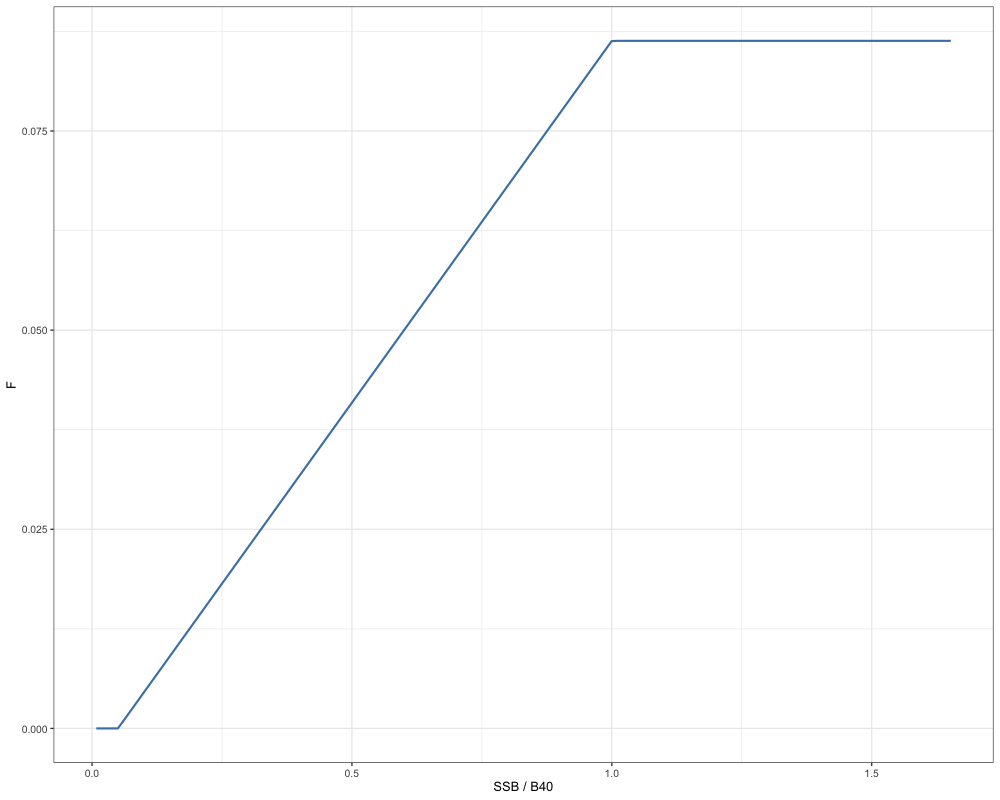
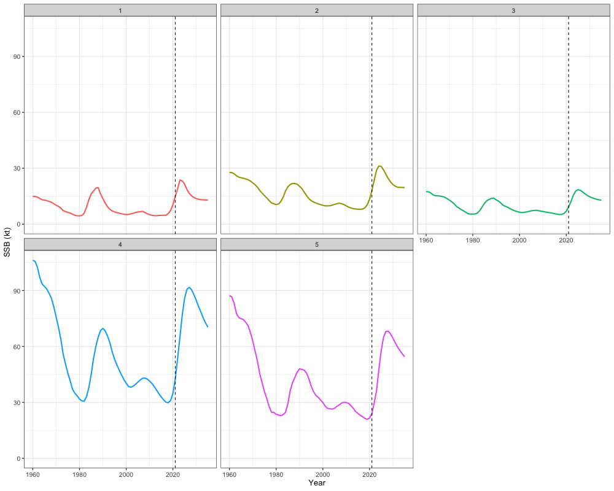
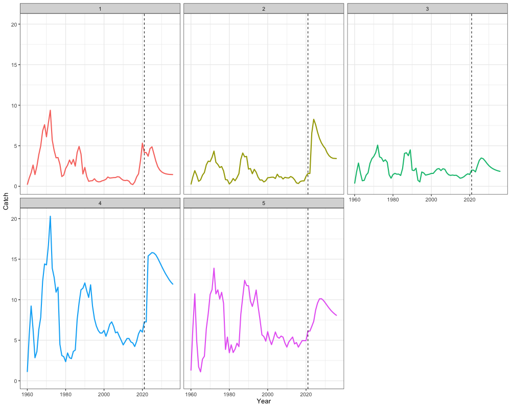

```{r, include = FALSE}
knitr::opts_chunk$set(
  collapse = TRUE,
  comment = "#>"
)
```

```{r setup, warning = FALSE, message = FALSE, eval = TRUE, warning = FALSE}
# Load in packages
library(SPoRC) 
library(here)
library(RTMB)
library(ggplot2)
library(dplyr)
library(tidyr)
library(purrr)
```

Several options exist for deriving management reference points and catch advice in `SPoRC`. In this vignette, we will first discuss the mathematical details for deriving different management reference points, and then demonstrate how catch advice might be developed with estimated reference points.

# Reference Points

Management reference points in `SPoRC` are divided into single-region and spatial reference points.

Single-region reference points include:

- Spawning potential ratio (SPR) reference points, which estimate the fishing mortality rate that reduces spawning biomass per recruit to x% of the unfished level.

- Maximum sustainable yield (MSY) reference points, based on a Beverton-Holt relationship, which estimate the fishing mortality rate that maximizes long-term yield.

Spatial reference points also include both SPR and MSY-based metrics, but are further divided into:

- Independent SPR reference points, which estimate region-specific fishing mortality rates that reduce spawning biomass per recruit to x% of the unfished level, while ignoring movement.

- Independent MSY reference points, which estimate region-specific fishing mortality rates that maximize yield within a given region.

- Global SPR reference points, which estimate a global fishing mortality rate that reduces total spawning biomass per recruit to x% of the unfished level, accounting for movement.

- Global MSY reference points, which estimate a global fishing mortality rate that maximizes long-term yield across all regions.

## Single Region

### Spawning Potential Ratio Reference Points {#sglregionspr}
To derive SPR reference points, users must specify a target percentage representing the spawning biomass per recruit under fishing relative to the unfished level. Following that, several additional quantities are needed to compute these reference points. This includes: 

- the relative fishing mortality between fleets ($Frat_f = Fmort_{y = term,f} / \sum_f Fmort_{y = term,f}$), 
- fleet-specific fishery selectivity ($Sel_{y = term,a,s = 1,f}^{Fsh}$),
- natural mortality for females ($NatMort_{y=1,a,s=1}$), 
- weight at age for females ($W_{y=1,a,s=1}$),
- maturity at age for females ($Mat_{y=1,a,s=1}$), 
- spawn timing ($t_{spwn}$), 
- a vector of recruitment values ($Rec_{y,s}$), 
- the recruitment sex ratio ($\psi_s$), 
- recruitment age ($RecAge$), and
- the first year in the recruitment vector ($RecYear$) to be used for mean recruitment calculations. 

For relative fishing mortality between fleets and fleet-specific fishery selectivity, the terminal year is utilized for these calculations. By contrast, estimates from the first model year are utilized for natural mortality, weight at age, and maturity at age.

SPR reference points are then derived with the following process:

\[
N_{a = 1}^{fished} = 1
\]

\[
N_{a = 1}^{unfished} = 1
\]

where $N_{a = 1}^{fished}$ and $N_{a = 1}^{unfished}$ are the fished and unfished numbers at age per-recruit, respectively, for the first age class. Subsequent numbers at age per-recruit are then computed with an exponential mortality model, where fished numbers at age per-recruit are decremented with both natural and fishing mortality, while unfished numbers at age per-recruit are only decremented with natural mortality:

\[
N_{a}^{\text{fished}} = 
\begin{cases}
N_{a - 1}^{\text{fished}} \cdot \exp\left(-\left(NatMort_{y=1,a-1,s=1} + \sum_f \text{Frat}_f \cdot F_x \cdot \text{Sel}_{y=\text{term},a-1,s=1,f}^{\text{Fsh}}\right)\right) & \text{if } 2 < a < n_{\text{ages}} \\
\\
N_{a - 1}^{\text{fished}} \cdot 
\frac{
\exp\left(-\left(NatMort_{y=1,n_{\text{ages}}-1,s=1} + \sum_f \text{Frat}_f \cdot F_x \cdot \text{Sel}_{y=\text{term},n_{\text{ages}}-1,s=1,f}^{\text{Fsh}}\right)\right)
}{
1 - \exp\left(-\left(NatMort_{y=1,n_{\text{ages}},s=1} + \sum_f \text{Frat}_f \cdot F_x \cdot \text{Sel}_{y=\text{term},n_{\text{ages}},s=1,f}^{\text{Fsh}}\right)\right)
} & \text{if } a = n_{\text{ages}}
\end{cases}
\]

\[
N_{a}^{\text{unfished}} = 
\begin{cases}
N_{a - 1}^{\text{unfished}} \cdot \exp\left(-NatMort_{y=1,a-1,s=1}\right) & \text{if } 2 < a < n_{\text{ages}} \\
\\
N_{a - 1}^{\text{unfished}} \cdot 
\frac{
\exp\left(-NatMort_{y=1,n_{\text{ages}}-1,s=1}\right)
}{
1 - \exp\left(-NatMort_{y=1,n_{\text{ages}},s=1}\right)
} & \text{if } a = n_{\text{ages}}
\end{cases}
\]

where $F_x$ represents the estimated fishing mortality rate that reduces the spawning biomass per recruit to x%, relative to the unfished level. Fished and unfished numbers at age per recruit can then be converted to spawning biomass per recruit quantities ($SSB$) with the following equations:

\[
SSB^{\text{fished}} = \sum_a N_{a}^{\text{fished}} \cdot W_{y=1,a,s=1} \cdot \text{Mat}_{y=1,a,s=1} \cdot \exp\left(-t_{\text{spwn}} \cdot NatMort_{y=1,a,s=1} + \sum_f \text{Frat}_f \cdot F_x \cdot \text{Sel}_{y=\text{term},a,s=1,f}^{\text{Fsh}} \right)
\]

\[
SSB^{\text{unfished}} = \sum_a N_{a}^{\text{unfished}} \cdot W_{y=1,a,s=1} \cdot \text{Mat}_{y=1,a,s=1} \cdot \exp\left(-t_{\text{spwn}} \cdot NatMort_{y=1,a,s=1} \right)
\]


SPR is then defined as the fraction of fished and unfished spawning biomass per recruit:

\[
SPR = \frac{SSB^{fished}}{SSB^{unfished}}
\]

and $F_x$ is solved for using a non-linear function minimizer by minimizing the following criteria:

\[
F_x = \arg\min_{F} \left\{ 100 \cdot \left( \text{SPR}(F) - \text{x%} \right)^2 \right\}
\]

Biological SPR-based reference points ($B_x$) can then be derived by multiplying the fished spawning biomass per recruit by mean recruitment over a user-defined period and the recruitment sex-ratio:

\[
B_x = SSB^{\text{fished}} \cdot \frac{\sum_{RecYear}^{Y - RecAge} Rec_{y,s}}{Y - RecAge - RecYear} \psi_s
\]

### Maximum Sustainable Yield Reference Points (Beverton-Holt) {#sglregionmsy}
Deriving MSY based reference points using a Beverton-Holt stock recruitment relationship involves maximizing the equilibrium yield per recruit and requires several additional inputs. For completeness, we summarize the required inputs to derive MSY based reference points when assuming a Beverton-Holt relationship. These inputs include:

- the relative fishing mortality between fleets ($Frat_f = Fmort_{y = term,f} / \sum_f Fmort_{y = term,f}$), 
- fleet-specific fishery selectivity ($Sel_{y = term,a,s = 1,f}^{Fsh}$),
- natural mortality for females ($NatMort_{y=1,a,s=1}$), 
- weight at age for females ($W_{y=1,a,s=1}$),
- maturity at age for females ($Mat_{y=1,a,s=1}$), 
- an estimate of virgin recruitment ($R_0$),
- an estimate of steepness ($h$),
- the recruitment sex ratio ($\psi_s$).

Similarly, for relative fishing mortality between fleets and fleet-specific fishery selectivity, terminal year estimates are utilized for these calculations. By contrast, estimates from the first model year are utilized for natural mortality, weight at age, and maturity at age.

MSY reference points can then be derived using the standard per-recruit calculations, where the initial number of fished and unfished individuals can be set at an arbitrary value:

\[
N_{a = 1}^{fished} = 1 
\]

\[
N_{a = 1}^{unfished} = 1
\]

The following numbers-at-age per recruit are then decremented with an exponential mortality model:

\[
  N_{a}^{\text{fished}} = 
    \begin{cases}
  N_{a - 1}^{\text{fished}} \cdot \exp\left(-\left(NatMort_{y=1,a-1,s=1} + \sum_f \text{Frat}_f \cdot F_{msy} \cdot \text{Sel}_{y=\text{term},a-1,s=1,f}^{\text{Fsh}}\right)\right) & \text{if } 2 < a < n_{\text{ages}} \\
  \\
  N_{a - 1}^{\text{fished}} \cdot 
  \frac{
    \exp\left(-\left(NatMort_{y=1,n_{\text{ages}}-1,s=1} + \sum_f \text{Frat}_f \cdot F_{msy} \cdot \text{Sel}_{y=\text{term},n_{\text{ages}}-1,s=1,f}^{\text{Fsh}}\right)\right)
  }{
    1 - \exp\left(-\left(NatMort_{y=1,n_{\text{ages}},s=1} + \sum_f \text{Frat}_f \cdot F_{msy} \cdot \text{Sel}_{y=\text{term},n_{\text{ages}},s=1,f}^{\text{Fsh}}\right)\right)
  } & \text{if } a = n_{\text{ages}}
  \end{cases}
  \]

\[
  N_{a}^{\text{unfished}} = 
    \begin{cases}
  N_{a - 1}^{\text{unfished}} \cdot \exp\left(-NatMort_{y=1,a-1,s=1}\right) & \text{if } 2 < a < n_{\text{ages}} \\
  \\
  N_{a - 1}^{\text{unfished}} \cdot 
  \frac{
    \exp\left(-NatMort_{y=1,n_{\text{ages}}-1,s=1}\right)
  }{
    1 - \exp\left(-NatMort_{y=1,n_{\text{ages}},s=1}\right)
  } & \text{if } a = n_{\text{ages}}
  \end{cases}
  \]

where $F_{msy}$ here represents the fishing mortality that would result in equilibrium yield being maximized. Yield per recruit quantities can then be computed using Baranov's catch equation:

\[
C_{a} = 
\frac{
  \sum_f \text{Frat}_f \cdot F_{\text{msy}} \cdot \text{Sel}_{y=\text{term},a-1,s=1,f}^{\text{Fsh}}
}{
  \left(NatMort_{y=1,a-1,s=1} + \sum_f \text{Frat}_f \cdot F_{\text{msy}} \cdot \text{Sel}_{y=\text{term},a-1,s=1,f}^{\text{Fsh}}\right)
}
\cdot
N_a^{\text{fished}} \cdot 
\left(
  1 - \exp\left[
    -\left(
      NatMort_{y=1,n_{\text{ages}},s=1} + \sum_f \text{Frat}_f \cdot F_{\text{msy}} \cdot \text{Sel}_{y=\text{term},n_{\text{ages}},s=1,f}^{\text{Fsh}}
    \right)
  \right]
\right)
\]

Values for equilibrium recruitment are then calculated using the Beverton-Holt stock recruitment relationship. Estimates of equilibrium recruitment are needed to convert per recruit quantities to yield and $B_{msy}$. Here, we first derive the fished and unfished spawning biomass per recruit:

\[
SSB^{\text{fished}} = \sum_a N_{a}^{\text{fished}} \cdot W_{y=1,a,s=1} \cdot \text{Mat}_{y=1,a,s=1} \cdot \exp\left(-t_{\text{spwn}} \cdot NatMort_{y=1,a,s=1} + \sum_f \text{Frat}_f \cdot F_x \cdot \text{Sel}_{y=\text{term},a,s=1,f}^{\text{Fsh}} \right) 
\]

\[
SSB^{\text{unfished}} = \sum_a N_{a}^{\text{unfished}} \cdot W_{y=1,a,s=1} \cdot \text{Mat}_{y=1,a,s=1} \cdot \exp\left(-t_{\text{spwn}} \cdot NatMort_{y=1,a,s=1} \right)
\]

Equilibrium recruitment can then be derived with the following:

\[
Req = \frac{4\cdot h \cdot R_0 \cdot SSB^{\text{fished}}}{SSB^{\text{unfished}} \cdot (1 - h) + SSB^{\text{fished}} \cdot (5 \cdot h - 1)}
\]

where $Req$ is the equilibrium recruitment. Yield and $B_{msy}$ can then be computed by multiplying the yield per recruit and spawning biomass per recruit by an estimate of equilibrium recruitment:

\[
Yield = \sum_a C_a \cdot Req 
\]

\[
B_{msy} = SSB^{\text{fished}} \cdot Req
\]

Lastly, $F_{msy}$ is solved for using a non-linear function minimizer by minimizing the following criteria (maximizing yield):

\[
F_{msy} = \arg\min_{F} Yield
\]

## Multi Region

### Spawning Potential Ratio Reference Points
In general, multi region SPR reference points can be computed in a similar manner as single region SPR reference points. The additional complication to calculating spatial reference points includes the additional region subscript for all quantities, as well as the **potential** need to account for movement processes.

#### Independent
In the case where users assume no movement occurs among regions, SPR rates can be calculated independently for each region, which results in region-specific $F_{r,x}$ and $B_{r,x}$ estimates. Thus, each region has a unique $F_{r,x}$ estimate that can be applied. All calculations are computed in the same manner as equations described for computing SPR rates in the [single region case](#sglregionspr) except that an additional subscript is added to all demographic rates. Following that, $F_{r,x}$ can then be solved for by minimizing the following criteria for each region:

\[
F_{r,x} = \arg\min_{F_r} \left\{ 100 \cdot \left( \text{SPR}(F_r) - \text{x%} \right)^2 \right\}
\]

Regional biological SPR-based reference points ($B_x$) can then be derived by multiplying the fished spawning biomass per recruit by regional mean recruitment over a user-defined period and the recruitment sex-ratio:

\[
B_{r,x} = SSB_r^{\text{fished}} \cdot \frac{\sum_{RecYear}^{Y - RecAge} Rec_{r,y,s}}{Y - RecAge - RecYear} \psi_s
\]

#### Global
In contrast to computing reference points when assuming independent populations, SPR rates can also be computed globally, where movement occurs among regions. Given the assumption of global SPR rates, this results in a global $F_x$ estimate, but regional estimates of $B_{r,x}$ because mean recruitment estimates are defined regionally. Thus, the global SPR solution results in a $F_x$ that reduces the global spawning biomass per recruit to x% of its unfished value, such that the aggregate spawning biomass reaches equilibrium at $\sum_r B_{r,x}$ if applied over the long-term. However, this solution does not result in each region reaching equilibrium at $B_{r,x}$. Note that the same value of $F_x$ is applied to each region in the global SPR case.

Deriving global SPR reference points requires a different set of inputs. These include:

- the relative fishing mortality between fleets ($Frat_{r,f} = Fmort_{r,y = term,f} / \sum_f Fmort_{r,y = term,f}$), 
- fleet-specific fishery selectivity ($Sel_{r,y = term,a,s = 1,f}^{Fsh}$),
- natural mortality for females ($NatMort_{r,y=1,a,s=1}$), 
- weight at age for females ($W_{r,y=1,a,s=1}$),
- maturity at age for females ($Mat_{r,y=1,a,s=1}$), 
- spawn timing ($t_{spwn}$), 
- a vector of recruitment values ($Rec_{r,y,s}$), 
- a matrix of movement values ($\boldsymbol{M}_{y = \text{term},\, a,\, s = 1}$)
- the recruitment sex ratio ($\psi_s$), 
- recruitment age ($RecAge$), 
- the first year in the recruitment vector ($RecYear$) to be used for mean recruitment calculations, and 
- the recruitment proportions (apportionment) by area ($\zeta_r$).

Global SPR reference points are calculated by first setting the regional numbers-at-age in the per-recruit model equal to the estimated recruitment apportionment parameters (\(\zeta_r\)), which sum to 1:

\[
N_{r,a = 1}^{\text{fished}} = \zeta_r
\]

\[
N_{r,a = 1}^{\text{unfished}} = \zeta_r
\]

Here, \(N_{r,a=1}^{\text{fished}}\) and \(N_{r,a=1}^{\text{unfished}}\) represent the regional numbers-at-age per recruit (for the first age class) under fished and unfished conditions, respectively.

Subsequently, movement is applied. If recruits are allowed to move, the movement matrix is applied starting from age 1; otherwise, it is applied starting from age 2:

\[
\boldsymbol{N}_a^{\text{fished}} = (\boldsymbol{N}_a^{\text{fished}})^\top \boldsymbol{M}_{y = \text{term}, a, s = 1} \quad \text{for } a = a_{\min}, \dots, A, \quad a_{\min} = 
\begin{cases} 
1 & \text{if recruits move} \\
2 & \text{otherwise}
\end{cases}
\]

\[
\boldsymbol{N}_a^{\text{unfished}} = (\boldsymbol{N}_a^{\text{unfished}})^\top \boldsymbol{M}_{y = \text{term}, a, s = 1} \quad \text{for } a = a_{\min}, \dots, A, \quad a_{\min} = 
\begin{cases} 
1 & \text{if recruits move} \\
2 & \text{otherwise}
\end{cases}
\]

In these expressions, \(A\) denotes the number of modeled ages ($n_{ages}$) in `SPoRC` multiplied by 10. For example, if 30 ages are modeled, then \(A = 300\). This extension enables iterative propagation of the plus group under movement, given that no closed-form solution exists. For \(a > n_{ages}\)  in `SPoRC`, all demographic and fishery parameters are held constant at the values for the terminal modeled age ($n_{ages}$). Following movement processes, an exponential mortality model is then applied:

\[
N_{r,a}^{\text{fished}} = N_{r,a - 1}^{\text{fished}} \cdot \exp\left(-\left(NatMort_{r,y=1,a-1,s=1} + \sum_f \text{Frat}_{r,f} \cdot F_{x} \cdot \text{Sel}_{r,y=\text{term},a-1,s=1,f}^{\text{Fsh}}\right)\right)
\quad \text{if } 2 < a < A
\]

\[
N_{r,a}^{\text{unfished}} = N_{r,a - 1}^{\text{unfished}} \cdot \exp\left(-\left(NatMort_{r,y=1,a-1,s=1}\right)\right)
\quad \text{if } 2 < a < A
\]

Again, fished and unfished numbers at age per recruit can then be converted to spawning biomass per recruit quantities:

\[
SSB^{\text{fished}}_r = \sum_a N_{r,a}^{\text{fished}} \cdot W_{r,y=1,a,s=1} \cdot \text{Mat}_{r,y=1,a,s=1} \cdot \exp\left(-t_{\text{spwn}} \cdot NatMort_{r,y=1,a,s=1} + \sum_f \text{Frat}_{r,f} \cdot F_x \cdot \text{Sel}_{r,y=\text{term},a,s=1,f}^{\text{Fsh}} \right)
\]

\[
SSB^{\text{unfished}}_r = \sum_a N_{r,a}^{\text{unfished}} \cdot W_{r,y=1,a,s=1} \cdot \text{Mat}_{r,y=1,a,s=1} \cdot \exp\left(-t_{\text{spwn}} \cdot NatMort_{r,y=1,a,s=1} \right)
\]

and the global spawning potential ratio can then be computed as:

\[
SPR = \frac{\sum_r SSB^{\text{fished}}_r}{\sum_r SSB^{\text{fished}}_r}
\]

where $F_x$ is solved for using a non-linear function minimzer by minimizing the following criteria for global SPR:

\[
F_x = \arg\min_{F} \left\{ 100 \cdot \left( \text{SPR}(F) - \text{x%} \right)^2 \right\}
\]

Then, biological SPR-based reference points are assumed to be regional ($B_{r,x}$) and are derived by multiplying the fished spawning biomass per recruit by regional mean recruitment over a user-defined period and the recruitment sex-ratio:

\[
B_{r,x} = SSB^{\text{fished}}_r \cdot \frac{\sum_{RecYear}^{Y - RecAge} Rec_{r,y,s}}{Y - RecAge - RecYear} \psi_s
\]

Thus, the global SPR calculations result in a global $F_x$ and regional $B_{r,x}$ estimates.

### Maximum Sustainble Yield Reference Points (Beverton-Holt)

MSY-based reference points assuming a Beverton-Holt stock recruitment relationship can be derived either assuming independent populations without movement or a global population with movement processes incorporated.

#### Independent

Deriving MSY reference points assuming independent populations is similar to a single-region case, and results in region-specific $F_{r,msy}$ and $B_{r,msy}$ estimates, which can be applied to each region when conducting catch projections to determine management advice.In general, all calcualtions are computed in the same manner as equations described for computing MSY in the [single region case](#sglregionmsy), with the exception that demographic rates and fishery selectivity include a region subscript. Notably, virgin recruitment is considered regional to compute equilibrium recruitment in these calculations and is derived in the following manner:

\[
R_{r,0} = R_0 \zeta_r 
\]

\[
Req_r = \frac{4\cdot h_r \cdot R_{r,0} \cdot SSB_r^{\text{fished}}}{SSB_r^{\text{unfished}} \cdot (1 - h_r) + SSB_r^{\text{fished}} \cdot (5 \cdot h_r - 1)}
\]

$F_{r,msy}$ is then derived by minimizing (maximizing) yield for each region independently:

\[
F_{r,msy} = \arg\min_{F_r} Yield_r
\]

and $B_{r,msy}$ can then be derived as:

\[
B_{r,msy} = SSB_r^{fished} Req_r
\]

#### Global
Deriving global MSY in a spatial cointext requires movement among regions to be accounted for. Similar to the global SPR case, this results in a global $F_{msy}$ estimate, but regional estiamtes of $B_{r,msy}$ because recruitment parameters are defined regionally. This results in a reference point that achieves $\sum_r B_{r,msy}$ for the entire population if $F_{msy}$ is applied to each region, but does not ensure that each region is at $B_{r,msy}$.

Global MSY reference points requires the following inputs:

- the relative fishing mortality between fleets ($Frat_{r,f} = Fmort_{r,y = term,f} / \sum_f Fmort_{r,y = term,f}$), 
- fleet-specific fishery selectivity ($Sel_{r,y = term,a,s = 1,f}^{Fsh}$),
- natural mortality for females ($NatMort_{r,y=1,a,s=1}$), 
- weight at age for females ($W_{r,y=1,a,s=1}$),
- maturity at age for females ($Mat_{r,y=1,a,s=1}$), 
- spawn timing ($t_{spwn}$), 
- a vector of recruitment values ($Rec_{r,y,s}$), 
- a matrix of movement values ($\boldsymbol{M}_{y = \text{term},\, a,\, s = 1}$)
- the recruitment sex ratio ($\psi_s$), 
- recruitment age ($RecAge$), 
- the first year in the recruitment vector ($RecYear$) to be used for mean recruitment calculations, 
- the global steepness value to be used, which is taken as the mean across all regions if steepness is estimated to be regional ($h = \frac{\sum_r h_r}{n_{regions}}$), and 
- the recruitment proportions (apportionment) by area ($\zeta_r$).

Using standard per-recruit calculations, we will first define the initial number of fished and unfished individuals based on the recruitment proportions to each area:

\[
N_{r,a = 1}^{\text{fished}} = \zeta_r 
\]
\[
N_{r,a = 1}^{\text{unfished}} = \zeta_r
\]

Here, \(N_{r,a=1}^{\text{fished}}\) and \(N_{r,a=1}^{\text{unfished}}\) represent the regional numbers-at-age per recruit (for the first age class) under fished and unfished conditions, respectively. We can then apply movement dynamics. If recruits are allowed to move, the movement matrix is applied starting from age 1; otherwise, it is applied starting from age 2:

\[
\boldsymbol{N}_a^{\text{fished}} = (\boldsymbol{N}_a^{\text{fished}})^\top \boldsymbol{M}_{y = \text{term}, a, s = 1} \quad \text{for } a = a_{\min}, \dots, A, \quad a_{\min} = 
\begin{cases} 
1 & \text{if recruits move} \\
2 & \text{otherwise}
\end{cases}
\]

\[
\boldsymbol{N}_a^{\text{unfished}} = (\boldsymbol{N}_a^{\text{unfished}})^\top \boldsymbol{M}_{y = \text{term}, a, s = 1} \quad \text{for } a = a_{\min}, \dots, A, \quad a_{\min} = 
\begin{cases} 
1 & \text{if recruits move} \\
2 & \text{otherwise}
\end{cases}
\]

In these expressions, \(A\) denotes the number of modeled ages ($n_{ages}$) in `SPoRC` multiplied by 10. For example, if 30 ages are modeled, then \(A = 300\). This extension enables iterative propagation of the plus group under movement, given that no closed-form solution exists. For \(a > n_{ages}\)  in `SPoRC`, all demographic and fishery parameters are held constant at the values for the terminal modeled age ($n_{ages}$). After movement processes occur, an exponential mortality model is then applied:

\[
N_{r,a}^{\text{fished}} = N_{r,a - 1}^{\text{fished}} \cdot \exp\left(-\left(NatMort_{r,y=1,a-1,s=1} + \sum_f \text{Frat}_{r,f} \cdot F_{msy} \cdot \text{Sel}_{r,y=\text{term},a-1,s=1,f}^{\text{Fsh}}\right)\right)
\quad \text{if } 2 < a < A
\]

\[
N_{r,a}^{\text{unfished}} = N_{r,a - 1}^{\text{unfished}} \cdot \exp\left(-\left(NatMort_{r,y=1,a-1,s=1}\right)\right)
\quad \text{if } 2 < a < A
\]

Baranov's catch equation is then invoked to compute yield per recruit in each regio:

\[
C_{r,a} = 
\frac{
  \sum_f \text{Frat}_{r,f} \cdot F_{\text{msy}} \cdot \text{Sel}_{r,y=\text{term},a-1,s=1,f}^{\text{Fsh}}
}{
  \left(NatMort_{r,y=1,a-1,s=1} + \sum_f \text{Frat}_{r,f} \cdot F_{\text{msy}} \cdot \text{Sel}_{r,y=\text{term},a-1,s=1,f}^{\text{Fsh}}\right)
}
\cdot
N_{r,a}^{\text{fished}} \cdot 
\left(
  1 - \exp\left[
    -\left(
      NatMort_{r,y=1,n_{\text{ages}},s=1} + \sum_f \text{Frat}_{r,f} \cdot F_{\text{msy}} \cdot \text{Sel}_{r,y=\text{term},n_{\text{ages}},s=1,f}^{\text{Fsh}}
    \right)
  \right]
\right)
\]

Equilibrium recruitment is then computed using the Beverton-Holt stock recruitment relationship, where we first need to derive the quantities for fished and unfished spawning biomass per recruit:

\[
SSB_r^{\text{fished}} = \sum_a N_{r,a}^{\text{fished}} \cdot W_{r,y=1,a,s=1} \cdot \text{Mat}_{r,y=1,a,s=1} \cdot \exp\left(-t_{\text{spwn}} \cdot NatMort_{r,y=1,a,s=1} + \sum_f \text{Frat}_{r,f} \cdot F_{msy} \cdot \text{Sel}_{r,y=\text{term},a,s=1,f}^{\text{Fsh}} \right)
\]

\[
SSB_r^{\text{unfished}} = \sum_a N_{r,a}^{\text{unfished}} \cdot W_{r,y=1,a,s=1} \cdot \text{Mat}_{r,y=1,a,s=1} \cdot \exp\left(-t_{\text{spwn}} \cdot NatMort_{r,y=1,a,s=1} \right)
\]

Calculations for equilibrium recruitment then follow as:

\[
Req_r = \frac{4\cdot h_r \cdot R_{0} \zeta_r \cdot SSB_r^{\text{fished}}}{SSB_r^{\text{unfished}} \cdot (1 - h) + SSB_r^{\text{fished}} \cdot (5 \cdot h - 1)}
\]

Lastly, yield and $B_{r,msy}$ can then be calculated by multiplying per recruit quantities by equilibrium recruitment:

\[
Yield_r = \sum_a \sum_r C_{r,a} \cdot Req_r
B_{r,msy} = SSB_r^{fished} \cdot Req_r
\]

and $F_{msy}$ is solved for by minimizing (or maximizing) the system wide yield:

\[
F_{msy} = \arg\min_{F} Yield
\]

# Deriving Catch Advice and Projections

A core part of the assessment process is to convert reference point estimates into catch advice. In the following sections, we will mathematically describe how catch advice is derived, and proceed to provide code examples for demonstration. To conduct projection from the terminal year, users must define the following quantities:

- Terminal year estimates of numbers-at-age,
- A user defined period of of recruitment values to use,
- A user defined period of weight-at-age values to use for projections,
- A user defined period of natural mortality-atage values to use for projections,
- A user defined period of maturity-at-age values to use for projections,
- A user defined period of fishery selectivity values to use for projections,
- A user defined period of movement values to use for projections, 
- Terminal year estimates of fishing mortality,
- Fishing mortality rate to use to decrement the population,

Optionally, users can define:

- Biological reference points to use to project fishing mortality in the subsequent years, if a harvest control rule is utilized, and
- A function describing a harvest control rule.

In the first year of the projection period, projected fishing mortality is determined with estimates of fishing mortality in the terminal year of the assessment:

\[
projF_{r,y} = \sum_f Fmort_{r,y = term,f}
\]

Total mortality can then be computed as:

\[
F_{r,y,a,s,f} = projF_{r,y} \cdot Frat_{r,f} \cdot Sel^{Fsh}_{r,y,a,s,f} 
\]

\[
Z_{r,y,a,s,f} = \sum_f F_{r,y,a,s,f} + NatMort_{r,y,a,s}
\]

Similarly, projected numbers at age in the first year utilizes estimates of numbers at age in the terminal year of the assessment, for which movement has already been applied. An exponential mortality model is then used to determine the numbers at age in the next year ($y+1$):

\[
projN_{r,y,a,s} = N_{r,y = term,a,s}
\]

\[
\begin{aligned}
projN_{r,y+1,a+1,s} = projN_{r,y,a,s}\exp(-Z_{r,y,a,s}), \quad \text{for } 1 \leq a < a_+ \\
projN_{r,y+1,a,s} = projN_{r,y,a-1,s}\exp(-Z_{r,y,a-1,s}) + projN_{r,y,a,s}\exp(-Z_{r,y,a,s}), \quad \text{for } a = a_+
\end{aligned}
\]

Quantities of spawning stock biomass can then be computed as:

\[
projSSB_{r,y} = \sum_a^{a+} projN_{r,y,a,s=1}W_{r,y,a,s=1}Mat_{r,y,a,s=1}
\]

Additionally, quantities of projected catch can be derived using Baranov's catch equation:

\[
projC^a_{r,y,a,s,f} = \frac{Fmort_{r,y,f}Sel^{Fsh}_{r,y,a,s,f}}{Z_{r,y,a,s}} projN_{r,y,a,s} \left[1-\exp(-Z_{r,y,a,s})\right]
\]

\[
projCatch_{r,y,f} = \sum_a^{a_+} \sum_s^{n_s} projC^a_{r,y,a,s,f} W_{r,y,a,s}
\]

Fishing mortality in the next year can then be projected forward using either a harvest control rule, or projected forward using user inputs:

\[
projF_{r,y+1} = 
\begin{cases}
f(SSB_{r,y}; BRP_{r,y}; FRP_{r,y}) & \text{if using a HCR}  \\ 
f(Finput_{r,y}) & \text{if using a user defined fishing mortality rate} 
\end{cases}
\]

where $f()$ is a harvest control function that takes the inputs $SSB$, $BRP$ (biological reference points), and $FRP$ (a fishery reference point). Alternatively, $f()$ can be a user defined matrix of fishing mortality rates to use during the projection period across regions. Projected fishing mortality is then summed with natural mortaltiy to compute the projected total mortality in a given projection year. 

Recruitment dynamics are then projected in each year following the initial projection year. In particular, several recruitment projection options are availiable. These include both deterministic predictions as well as the ability to incorporate stochasticity into recruitment projections. 

In particular, deterministic recruitment has the option to be projected forward as `zero`:

\[
projN_{r,y,1,s} = 0, \text{if y > 1}
\]

where no recruitment occurs. Deterministic recruitment can also be projected forward using mean recruitment (`mean_rec`) from a matrix of estimated recruitment values from the assessment model supplied by the user:

\[
projN_{r,y,1,s} = \frac{\sum_y Rec_{r,y}}{n}, \text{if y > 1}
\]

Alternatively, users can also specify a Beverton-Holt stock recruitment function (`bh_rec`) to be used for deterministic recruitment projection, which then requires users to supply the necessary parameter inputs. In the case where local recruitment is specified, this is computed as (i.e., metapopulation dynamics):

\[
projN_{r,y,1,s} = \frac{4\cdot h_r \cdot R_{r,0} \cdot projSSB_r}{SSB_r^{\text{unfished}} \cdot (1 - h_r) + projSSB_r \cdot (5 \cdot h_r - 1)}
\]

By contrast, if global recruitment is specified, this is computed as:

\[
projN_{r,y,1,s} = \left( \frac{4\cdot h \cdot R_{0} \cdot \sum_r projSSB_r}{\sum_r SSB_r^{\text{unfished}} \cdot (1 - h) + \sum_r projSSB_r \cdot (5 \cdot h - 1)} \right) \zeta_r
\]

where density-dependence occurs globally, and a recruitment apportionment parameter is utilized to partition global recruits in a given year.

Lastly, users can specify recruitment projections to be stochastic, wherein an inverse Gaussian (`inv_gauss`) distribution parameterized based on estimated recruitment values from the assessment model is utilized to project recruitment into the future:

\[
\text{AMeanRec}_r = \frac{1}{Y} \sum_{y=1}^{Y} \text{Rec}_{r,y}
\]

\[
\text{HMeanRec}_r = \left( \frac{1}{Y} \sum_{y=1}^{Y} \frac{1}{\text{Rec}_{r,y}} \right)^{-1}
\]

\[
\gamma_r = \frac{\text{AMeanRec}_r}{\text{HMeanRec}_r}
\]

\[
\beta_r = \text{AMeanRec}_r
\]

\[
\delta_r = \frac{1}{\gamma_r - 1}
\]

\[
\text{CVRec}_r = \sqrt{ \frac{1}{\delta_r} }
\]

For each year a random draw is made from a standard normal distribution, which is then transformed:
  
  \[
    \psi_y = B_y^2, \quad \text{where } B_y \sim N(0,1)
    \]

\[
  \omega_{r,y} = \beta_r \left( 1 + \frac{\psi_y - \sqrt{4 \delta_r \psi_y + \psi_y^2}}{2 \delta_r} \right)
  \]

\[
  \zeta_{r,y} = \beta_r \left( 1 + \frac{\psi_y + \sqrt{4 \delta_r \psi_y + \psi_y^2}}{2 \delta_r} \right)
  \]

\[
  \theta_{r,y} = \frac{\beta_r}{\beta_r + \omega_{r,i}}
\]

Then, a draw is conducted \(\sim U(0,1) \), and simulated recruitment is defined as:

\[
  \text{Rec}_{r,y}^{\text{sim}} =
    \begin{cases}
  \omega_{r,y}, & \text{if } U_y \leq \theta_{r,y} \\
  \zeta_{r,y}, & \text{otherwise}
  \end{cases}
  \]

Thus, this inverse gaussian mixture ensures the simulated values have approximately the correct mean and variability based on historical recruitment values.

After recruitment processes occur, the usual dynamics are then applied to project the population forward. Here, movement of individuals first occurs:

\[
\boldsymbol{projN}_a^ = (\boldsymbol{projN}_a)^\top \boldsymbol{M}_{y = \text{term}, a, s = 1} \quad \text{for } a = a_{\min}, \dots, A, \quad a_{\min} = 
\begin{cases} 
1 & \text{if recruits move} \\
2 & \text{otherwise}
\end{cases}
\]

Following movement, which is only applied in projected years \( y > 1 \), as it has already been accounted for in the terminal year estimates of numbers at age, the exponential mortality model is applied. Projected spawning stock biomass and catch are then derived. Fishing mortality in subsequent years is updated accordingly. This sequence of steps is repeated until the specified number of projection years is reached. Thus, catch advice for the year following the terminal assessment year corresponds to the projected catch in projection year 2 (i.e., \( projCatch_{r, y = 2, f} \)).

# Code Demonstration

In the subsequent sections, we will demonstrate how reference points, catch projections, catch advice, and stochastic projections can be derived and conducted using `SPoRC`. These features rely on users to have a report file from a `SPoRC` model, and we have generally coded this in a way that there is flexibility for users to define how projections are done.

## Getting Reference Points

### Single Region

To illustrate how reference points are derived, we begin by extracting the report file from the single-region sablefish case study (sgl_rg_sable_rep). We then call the Get_Reference_Points function to calculate the reference points. In the example below, we estimate the $F_{40}$ and $B_{40}$ values in a single-region context. This requires passing the sablefish data file (`sgl_reg_sable_data`) to the data argument, the report file to the rep argument, and setting the SPR rate (`SPR_x`) to 0.4. We also specify that the reference point is SPR-based and pertains to a single region. Additional inputs include the first year of recruitment used for calculating $B_{40}$, the recruitment age (which excludes the last `rec_age` years when computing the mean), the timing of spawning, and the sex ratio used in the $B_{40}$ calculation. Note that the sablefish example does not utilize a stock recruitment relationship. However, if a Beverton-Holt stock recruitment relationship is utilized and users want to estimate MSY-based reference points, this can be derived by setting `what = 'BH_MSY'`.

```{r}
data("sgl_rg_sable_rep") # read in single region report
data("sgl_rg_sable_data") # read in single region data 

# single area model
sgl_ref_pt <- SPoRC::Get_Reference_Points(data = sgl_rg_sable_data, # data file
                                          rep = sgl_rg_sable_rep, # report file
                                          SPR_x = 0.4, # spr rate
                                          type = 'single_region', # single region reference point
                                          what = 'SPR', # SPR reference point
                                          calc_rec_st_yr = 20, # first year to calculate mean recruitment
                                          rec_age = 2,  # exclues the last rec_age years when computing mean recruitment
                                          t_spwn = 0,  # spawn timing
                                          sex_ratio_f = 0.5 # recruitment sex-ratio for females
                                          )
sgl_ref_pt$f_ref_pt # F40
sgl_ref_pt$b_ref_pt # B40
```

Note that the sablefish example does not utilize a stock recruitment relationship. However, if a Beverton-Holt stock recruitment relationship is utilized and users want to estimate MSY-based reference points, this can be derived by setting `what = 'BH_MSY'`.

### Multi Region

In the following, we will demonstrate how spatial reference points can be derived. In general, this is similar to the single region case, except that a spatial model and associated report files will be needed (report file needs to be spatially-explicit). Again, we will use the five-region sablefish case study as an example, where we will estimate both independent SPR rates and global SPR rates. In contrast to the single region case, `type` would now need to be specified as `multi_region`. Additionally, for independent SPR rates where movement dynamics are ignored, `what` is now set at `independent_SPR`. All the other arguments are defined the same as the example above. Given that these are treated as independent populations, fishery reference points and biological reference points are region-specific and can be applied accordingly. 

```{r}
data("mlt_rg_sable_rep") # read in multi region report
data("mlt_rg_sable_data") # read in multi region data 

# multi region model with independent SPR
mlt_ref_pt_indp <- SPoRC::Get_Reference_Points(data = mlt_rg_sable_data, # data file
                                          rep = mlt_rg_sable_rep, # report file
                                          SPR_x = 0.4, # spr rate
                                          type = 'multi_region', # multi region reference point
                                          what = 'independent_SPR', # SPR reference point
                                          calc_rec_st_yr = 20, # first year to calculate mean recruitment
                                          rec_age = 2,  # exclues the last rec_age years when computing mean recruitment
                                          t_spwn = 0,  # spawn timing
                                          sex_ratio_f = 0.5 # recruitment sex-ratio for females
                                          )
mlt_ref_pt_indp$f_ref_pt # F40
mlt_ref_pt_indp$b_ref_pt # B40
```

By contrast, users can also specify global SPR rates. This involves simply changing the `what` argument to `global_SPR`, which results in a single $F_{40}$ being estimated, but region-specific $B_{r,40}$ given that regional estimates of recruitment are utilized. Note that the $F_{40}$ outputs 5 values for the 5 regions modelled in the case study, but these values are all identical. 

```{r}
data("mlt_rg_sable_rep") # read in multi region report
data("mlt_rg_sable_data") # read in multi region data 

# multi region model with global SPR
mlt_ref_pt_global <- SPoRC::Get_Reference_Points(data = mlt_rg_sable_data, # data file
                                                 rep = mlt_rg_sable_rep, # report file
                                                 SPR_x = 0.4, # spr rate
                                                 type = 'multi_region', # multi region reference point
                                                 what = 'global_SPR', # SPR reference point
                                                 calc_rec_st_yr = 20, # first year to calculate mean recruitment
                                                 rec_age = 2,  # exclues the last rec_age years when computing mean recruitment
                                                 t_spwn = 0,  # spawn timing
                                                 sex_ratio_f = 0.5 # recruitment sex-ratio for females
                                                 )
mlt_ref_pt_global$f_ref_pt # F40
mlt_ref_pt_global$b_ref_pt # B40
```

Similarly, MSY-based reference points assuming a Beverton-Holt stock recruitment function can be specified as well. This can be easily specified and involves either assuming independent populations (`what = 'independent_BH_MSY'`) or a population with global density dependence (`what = 'global_BH_MSY'`).

## Conducting Catch Projections to Derive Catch Advice (Deterministic Recruitment)

### Single Region
Next, using the reference points derived from the single region case study, we can conduct population and catch projections to derive catch advice. Note that this will require users to have a data file to extract the relevant demographic rates and data components, as well as a report file to extract necessary estimates to conduct projections. Let us first define a threshold harvest control rule to utilize in our population projections, although note that this is not strictly necessary.

```{r, eval = F}
# Define HCR to use
HCR_function <- function(x, frp, brp, alpha = 0.05) {
  stock_status <- x / brp # define stock status
  # If stock status is > 1
  if(stock_status >= 1) f <- frp
  # If stock status is between brp and alpha
  if(stock_status > alpha && stock_status < 1) f <- frp * (stock_status - alpha) / (1 - alpha)
  # If stock status is less than alpha
  if(stock_status < alpha) f <- 0
  return(f)
}

# Create a tibble for plotting
hcr_df <- tibble(
  i = 1:200,
  SSB_B40 = i / sgl_ref_pt$b_ref_pt,
  F = sapply(i, function(x) {
    HCR_function(x = x, frp = sgl_ref_pt$f_ref_pt, brp = sgl_ref_pt$b_ref_pt)
  })
)

# Plot
ggplot(hcr_df, aes(x = SSB_B40, y = F)) +
  geom_line(color = "steelblue", size = 1) +
  labs(x = "SSB / B40", y = "F") +
  theme_bw(base_size = 13)
```




We can define all the inputs needed to run the population projection:

```{r}

data("sgl_rg_sable_rep") # read in single region report
data("sgl_rg_sable_data") # read in single region data 

# Setup necessary inputs
t_spawn <- 0 # spawn timing
sexratio <- 0.5 # sex ratio
n_proj_yrs <- 15 # number of projection years
n_regions <- 1 # number of regions
n_ages <- length(sgl_rg_sable_data$ages) # number of ages
n_sexes <- sgl_rg_sable_data$n_sexes # number of sexes
n_fish_fleets <- sgl_rg_sable_data$n_fish_fleets # number of fishery fleets
do_recruits_move <- 0 # recruits don't move
terminal_NAA <- array(sgl_rg_sable_rep$NAA[,length(sgl_rg_sable_data$years),,], dim = c(n_regions, n_ages, n_sexes)) # terminal numbers at age
WAA <- array(rep(sgl_rg_sable_data$WAA[,length(sgl_rg_sable_data$years),,], each = n_proj_yrs), dim = c(n_regions, n_proj_yrs, n_ages, n_sexes)) # weight at age
WAA_fish <- array(rep(sgl_rg_sable_data$WAA[,length(sgl_rg_sable_data$years),,], each = n_proj_yrs), dim = c(n_regions, n_proj_yrs, n_ages, n_sexes, n_fish_fleets)) # weight at age for fishery
MatAA <- array(rep(sgl_rg_sable_data$MatAA[,length(sgl_rg_sable_data$years),,], each = n_proj_yrs), dim = c(n_regions, n_proj_yrs, n_ages, n_sexes)) # maturity at age
fish_sel <- array(rep(sgl_rg_sable_rep$fish_sel[,length(sgl_rg_sable_data$years),,,], each = n_proj_yrs), dim = c(n_regions, n_proj_yrs, n_ages, n_sexes, n_fish_fleets)) # selectivity
Movement <- array(rep(sgl_rg_sable_rep$Movement[,,length(sgl_rg_sable_data$years),,], each = n_proj_yrs), dim = c(n_regions, n_regions, n_proj_yrs, n_ages, n_sexes)) # movement
terminal_F <- array(sgl_rg_sable_rep$Fmort[,length(sgl_rg_sable_data$years),], dim = c(n_regions, n_fish_fleets)) # terminal F
natmort <- array(sgl_rg_sable_rep$natmort[,length(sgl_rg_sable_data$years),,], dim = c(n_regions, n_proj_yrs, n_ages, n_sexes)) # natural mortality
recruitment <- array(sgl_rg_sable_rep$Rec[,20:(length(sgl_rg_sable_data$years) - 2)], dim = c(n_regions, length(20:length(sgl_rg_sable_data$years) - 2))) # recruitment values to use for mean recruitment calculations or inverse gaussian parameterization

# Define reference points to use in HCR
f_ref_pt = array(sgl_ref_pt$f_ref_pt, dim = c(n_regions, n_proj_yrs))
b_ref_pt = array(sgl_ref_pt$b_ref_pt, dim = c(n_regions, n_proj_yrs))
```

Note that in these projections, all demographic rates (e.g., weight-at-age, movement, maturity) use estimates from the terminal year of the assessment. However, this is not required - users may instead define demographic rates for the projection period using other approaches (e.g., averages over the last 5 years). Regardless of the approach, rates must be provided by the user in the format and dimensions described above. A population projection can then be conducted with the `Do_Population_Projection` function:

```{r, eval = F}
# do population projection
out <- Do_Population_Projection(n_proj_yrs = n_proj_yrs, # Number of projection years
                               n_regions = n_regions, # number of regions
                               n_ages = n_ages, # number of ages
                               n_sexes = n_sexes, # number of sexes
                               sexratio = sexratio, # sex ratio for recruitment
                               n_fish_fleets = n_fish_fleets, # number of fishery fleets
                               do_recruits_move = do_recruits_move, # whether recruits move (not used since single area)
                               recruitment = recruitment, # recruitment values to use for mean recruitment 
                               terminal_NAA = terminal_NAA, # terminal numbers at age
                               terminal_F = terminal_F, # terminal F
                               natmort = natmort, # natural mortality values to use in projection
                               WAA = WAA, # weight at age values to use in projection spawning
                               WAA_fish = WAA_fish, # weight at age values to use in projection fishery
                               MatAA = MatAA, # maturity at age values to use in projection
                               fish_sel = fish_sel, # fishery selectivity values to use in projection
                               Movement = Movement, # movement values (not used since single area)
                               f_ref_pt = f_ref_pt, # fishery reference points (f40)
                               b_ref_pt = b_ref_pt, # biological reference points (b40)
                               HCR_function = HCR_function, # threshold control rule defined above
                               recruitment_opt = "mean_rec", # recruitment assumption utilizes the mean recruits for the supplied recruitment estimates
                               fmort_opt = "HCR", # Fishing mortality in projection years are determined using a HCR
                               t_spawn = t_spawn # Spawn timing
                               )

```

The outputted object from the function then includes the projected fishing mortality rates, the projected catch (i.e., the catch advice), the projected spawning stock biomass, the projected numbers at age, and the projected total mortality at age. We can plot a few of these quantities out below. In the example below, we show the projected SSB:

```{r, eval = F}
combined_ssb <- c(sgl_rg_sable_rep$SSB[1, -65], out$proj_SSB[1,]) # removing terminal year becauase repeated in projection calculations
years <- 1960:(2023 + n_proj_yrs)

ssb_df <- tibble(
  Year = years,
  SSB = combined_ssb
)

# Plot
ggplot(ssb_df, aes(x = Year, y = SSB)) +
  geom_line(size = 1) +
  geom_vline(xintercept = 2024, linetype = "dashed") + # projection start
  scale_y_continuous(limits = c(0, 300)) +
  labs(x = "Year", y = "SSB (kt)") +
  theme_bw(base_size = 13)
```


as well as projected catches, which can then be the basis of management advice:

```{r, eval = F}
combined_catch <- c(
  rowSums(sgl_rg_sable_rep$PredCatch[1, -65, ]), # removing terminal year becauase repeated in projection calculations
  rowSums(out$proj_Catch[1, , ])
)

years <- 1960:(2023 + n_proj_yrs)

catch_df <- tibble(
  Year = years,
  Catch = combined_catch
)

# Plot
ggplot(catch_df, aes(x = Year, y = Catch)) +
  geom_line(size = 1) +
  geom_vline(xintercept = 2024, linetype = "dashed") +  # projection start
  labs(x = "Year", y = "Catch (kt)") +
  theme_bw(base_size = 13)
sum(out$proj_Catch[1,2,]) # Catch advice in terminal year + 1
```


Importantly, catch advice should be based on terminal year+1 rather than the first projection year, since the first projection year serves only as an initialization step for the projection.

### Multi Region

In the following, we will then demonstrate how catch projections can be conducted in a multi-region context, using independent SPR rates, such that there are region-specific estimates of $F_{r,40}$ and $B_{r,40}$. In general, the steps are similar to the single-region case. Again, we will utilize the harvest control rule function defined above. Given that each region has their own unique estimates, this will result in different harvest control rules being applied to each region:

```{r, eval = F}
# Define HCR to use
HCR_function <- function(x, frp, brp, alpha = 0.05) {
  stock_status <- x / brp # define stock status
  # If stock status is > 1
  if(stock_status >= 1) f <- frp
  # If stock status is between brp and alpha
  if(stock_status > alpha && stock_status < 1) f <- frp * (stock_status - alpha) / (1 - alpha)
  # If stock status is less than alpha
  if(stock_status < alpha) f <- 0
  return(f)
}

# Build a dataframe by looping over j and i scalars
hcr_df <- expand.grid(
  j = 1:5,
  i = 1:50
) %>%
  mutate(
    frp = mapply(function(j) mlt_ref_pt_indp$f_ref_pt[j], j),
    brp = mapply(function(j) mlt_ref_pt_indp$b_ref_pt[j], j),
    F = mapply(function(i, j) {
      HCR_function(x = i, frp = mlt_ref_pt_indp$f_ref_pt[j], brp = mlt_ref_pt_indp$b_ref_pt[j])
    }, i, j),
    SSB_B40 = i / brp
  )

ggplot(hcr_df, aes(x = SSB_B40, y = F, color = factor(j))) +
  geom_line(lwd = 1.3) +
  facet_wrap(~j, scales = 'free') +
  labs(x = "SSB / B40", y = "F",  color = 'Region') +
  theme_bw(base_size = 13) +
  theme(legend.position = 'none')
```


Let's then define all the inputs needed to run the population projection:

```{r}

data("mlt_rg_sable_rep") # read in multi region report
data("mlt_rg_sable_data") # read in multi region data 

# Setup necessary inputs
t_spawn <- 0 # spawn timing
sexratio <- 0.5 # sex ratio
n_proj_yrs <- 15 # number of projection years
n_regions <- 5 # number of regions
n_ages <- length(mlt_rg_sable_data$ages) # number of ages
n_sexes <- mlt_rg_sable_data$n_sexes # number of sexes
n_fish_fleets <- mlt_rg_sable_data$n_fish_fleets # number of fishery fleets
do_recruits_move <- 0 # recruits don't move
terminal_NAA <- array(mlt_rg_sable_rep$NAA[,length(mlt_rg_sable_data$years),,], dim = c(n_regions, n_ages, n_sexes)) # terminal numbers at age
WAA <- array(rep(mlt_rg_sable_data$WAA[,length(mlt_rg_sable_data$years),,], each = n_proj_yrs), dim = c(n_regions, n_proj_yrs, n_ages, n_sexes)) # weight at age
WAA_fish <- array(rep(mlt_rg_sable_data$WAA[,length(mlt_rg_sable_data$years),,], each = n_proj_yrs), dim = c(n_regions, n_proj_yrs, n_ages, n_sexes, n_fish_fleets)) # weight at age
MatAA <- array(rep(mlt_rg_sable_data$MatAA[,length(mlt_rg_sable_data$years),,], each = n_proj_yrs), dim = c(n_regions, n_proj_yrs, n_ages, n_sexes)) # maturity at age
fish_sel <- array(rep(mlt_rg_sable_rep$fish_sel[,length(mlt_rg_sable_data$years),,,], each = n_proj_yrs), dim = c(n_regions, n_proj_yrs, n_ages, n_sexes, n_fish_fleets)) # selectivity
Movement <- aperm(abind::abind(replicate(n_proj_yrs, mlt_rg_sable_rep$Movement[,,length(mlt_rg_sable_data$years),,], simplify = FALSE), along = 5), perm = c(1,2,5,3,4)) # movement
terminal_F <- array(mlt_rg_sable_rep$Fmort[,length(mlt_rg_sable_data$years),], dim = c(n_regions, n_fish_fleets)) # terminal F
natmort <- array(mlt_rg_sable_rep$natmort[,length(mlt_rg_sable_data$years),,], dim = c(n_regions, n_proj_yrs, n_ages, n_sexes)) # natural mortality
recruitment <- array(mlt_rg_sable_rep$Rec[,20:(length(mlt_rg_sable_data$years) - 2)], dim = c(n_regions, length(20:length(mlt_rg_sable_data$years) - 2))) # recruitment values to use for mean recruitment calculations or inverse gaussian parameterization

# Define independent SPR reference points to use in HCR
f_ref_pt_indp = array(mlt_ref_pt_indp$f_ref_pt, dim = c(n_regions, n_proj_yrs))
b_ref_pt_indp = array(mlt_ref_pt_indp$b_ref_pt, dim = c(n_regions, n_proj_yrs))
```

When global reference points (SPR or MSY-based) are used, the same fishing mortality ($F$) is applied across all regions because only a single global $F$ is estimated. This is illustrated below:

```{r}
f_ref_pt_global = array(mlt_ref_pt_global$f_ref_pt, dim = c(n_regions, n_proj_yrs))
b_ref_pt_global = array(mlt_ref_pt_global$b_ref_pt, dim = c(n_regions, n_proj_yrs))
```

By contrast, the independent SPR approach assigns a region-specific $F$ value. For example, in the first projection year:

```{r}
# F40
f_ref_pt_indp[,2] # independent SPR
f_ref_pt_global[,2] # global SPR

# b40
b_ref_pt_indp[,2] # independent SPR
b_ref_pt_global[,2] # global SPR
```

For the projections that follow, we use independent SPR rates to allow for region-specific reference points:

```{r, eval = F}
# do population projection
out <- Do_Population_Projection(n_proj_yrs = n_proj_yrs, # Number of projection years
                              n_regions = n_regions, # number of regions
                              n_ages = n_ages, # number of ages
                              n_sexes = n_sexes, # number of sexes
                              sexratio = sexratio, # sex ratio for recruitment
                              n_fish_fleets = n_fish_fleets, # number of fishery fleets
                              do_recruits_move = do_recruits_move, # whether recruits move (not used since single area)
                              recruitment = recruitment, # recruitment values to use for mean recruitment 
                              terminal_NAA = terminal_NAA, # terminal numbers at age
                              terminal_F = terminal_F, # terminal F
                              natmort = natmort, # natural mortality values to use in projection
                              WAA = WAA, # weight at age values to use in projection spawning
                              WAA_fish = WAA_fish, # weight at age values to use in projection fishery
                              MatAA = MatAA, # maturity at age values to use in projection
                              fish_sel = fish_sel, # fishery selectivity values to use in projection
                              Movement = Movement, # movement values (not used since single area)
                              f_ref_pt = f_ref_pt_indp, # fishery reference points (f40)
                              b_ref_pt = b_ref_pt_indp, # biological reference points (b40)
                              HCR_function = HCR_function, # threshold control rule defined above
                              recruitment_opt = "mean_rec", # recruitment assumption utilizes the mean recruits for the supplied recruitment estimates
                              fmort_opt = "HCR", # Fishing mortality in projection years are determined using a HCR
                              t_spawn = t_spawn # Spawn timing
                              )
```

Again, we can visualize what these projections look like in terms of SSB and catch advice:
```{r, eval = F}
combined_ssb <- cbind(mlt_rg_sable_rep$SSB[,-62], out$proj_SSB[,]) # removing terminal year becauase repeated in projection calculations
combined_ssb_df <- reshape2::melt(combined_ssb) %>% 
  rename(Region = Var1, Year = Var2, SSB = value)

# Plot
ggplot(combined_ssb_df, aes(x = Year + 1959, y = SSB, color = factor(Region))) +
  geom_line(size = 1) +
  geom_vline(xintercept = 2021, linetype = "dashed") + # projection start
  facet_wrap(~Region) +
  scale_y_continuous(limits = c(0, NA)) +
  labs(x = "Year", y = "SSB (kt)") +
  theme_bw(base_size = 13) +
  theme(legend.position = 'none')
```




```{r, eval = F}
combined_catch <- cbind(apply(mlt_rg_sable_rep$PredCatch, c(1,2), sum), apply(out$proj_Catch, c(1,2), sum))
combined_catch_df <- reshape2::melt(combined_catch) %>% 
  rename(Region = Var1, Year = Var2, Catch = value)

# Plot
ggplot(combined_catch_df, aes(x = Year + 1959, y = Catch, color = factor(Region))) +
  geom_line(size = 1) +
  geom_vline(xintercept = 2021, linetype = "dashed") + # projection start
  facet_wrap(~Region) +
  scale_y_continuous(limits = c(0, NA)) +
  labs(x = "Year", y = "Catch") +
  theme_bw(base_size = 13) +
  theme(legend.position = 'none')

rowSums(out$proj_Catch[,2,]) # Catch advice by region in terminal year + 1
``` 



## Conducting Stochastic Population Projections

In the final section of this vignette, we demonstrate how to conduct stochastic population projections. For simplicity, we focus on the single-region case, though the approach extends similarly to multi-region scenarios. Stochastic projections follow the same general structure as deterministic ones, with the key difference being that `recruitment_opt = 'inv_gauss`' is specified to introduce variability in recruitment. For demonstration purposes, we will set up the following projection scenarios, which include:

1. Using $F_{40}$ for projections, where an HCR is applied to adjust the $F_{40}$ in each projection year,
2. Using $F = 0$ for projections.

Let us first redefine our single region inputs to use in our projection function, but also define the number of simulations to conduct (1000):

```{r, eval = F}

data("sgl_rg_sable_rep") # read in single region report
data("sgl_rg_sable_data") # read in single region data 

# Setup necessary inputs
n_sims <- 1e3 # number of simulations to conduct
t_spawn <- 0 # spawn timing
sexratio <- 0.5 # sex ratio
n_proj_yrs <- 15 # number of projection years
n_regions <- 1 # number of regions
n_ages <- length(sgl_rg_sable_data$ages) # number of ages
n_sexes <- sgl_rg_sable_data$n_sexes # number of sexes
n_fish_fleets <- sgl_rg_sable_data$n_fish_fleets # number of fishery fleets
do_recruits_move <- 0 # recruits don't move
terminal_NAA <- array(sgl_rg_sable_rep$NAA[,length(sgl_rg_sable_data$years),,], dim = c(n_regions, n_ages, n_sexes)) # terminal numbers at age
WAA <- array(rep(sgl_rg_sable_data$WAA[,length(sgl_rg_sable_data$years),,], each = n_proj_yrs), dim = c(n_regions, n_proj_yrs, n_ages, n_sexes)) # weight at age
WAA_fish <- array(rep(sgl_rg_sable_data$WAA[,length(sgl_rg_sable_data$years),,], each = n_proj_yrs), dim = c(n_regions, n_proj_yrs, n_ages, n_sexes, n_fish_fleets)) # weight at age for the fishery
MatAA <- array(rep(sgl_rg_sable_data$MatAA[,length(sgl_rg_sable_data$years),,], each = n_proj_yrs), dim = c(n_regions, n_proj_yrs, n_ages, n_sexes)) # maturity at age
fish_sel <- array(rep(sgl_rg_sable_rep$fish_sel[,length(sgl_rg_sable_data$years),,,], each = n_proj_yrs), dim = c(n_regions, n_proj_yrs, n_ages, n_sexes, n_fish_fleets)) # selectivity
Movement <- array(rep(sgl_rg_sable_rep$Movement[,,length(sgl_rg_sable_data$years),,], each = n_proj_yrs), dim = c(n_regions, n_regions, n_proj_yrs, n_ages, n_sexes)) # movement
terminal_F <- array(sgl_rg_sable_rep$Fmort[,length(sgl_rg_sable_data$years),], dim = c(n_regions, n_fish_fleets)) # terminal F
natmort <- array(sgl_rg_sable_rep$natmort[,length(sgl_rg_sable_data$years),,], dim = c(n_regions, n_proj_yrs, n_ages, n_sexes)) # natural mortality
recruitment <- array(sgl_rg_sable_rep$Rec[,20:(length(sgl_rg_sable_data$years) - 2)], dim = c(n_regions, length(20:length(sgl_rg_sable_data$years) - 2))) # recruitment values to use for mean recruitment calculations or inverse gaussian parameterization
```

We can then define our two projection scenarios to use in this example, as well as arrays to store our projection results in:

```{r, eval = F}
# Define the F used for each scenario 
proj_inputs <- list(
  # Scenario 1 - Using HCR to adjust f40
  list(f_ref_pt = array(sgl_ref_pt$f_ref_pt, dim = c(n_regions, n_proj_yrs)),
       b_ref_pt = array(sgl_ref_pt$b_ref_pt, dim = c(n_regions, n_proj_yrs)),
       fmort_opt = 'HCR'
  ),
  # Scenario 2 - F is set at 0
  list(f_ref_pt = array(0, dim = c(n_regions, n_proj_yrs)),
       b_ref_pt = NULL,
       fmort_opt = 'Input'
  )
)

# store outputs
all_scenarios_f <- array(0, dim = c(n_regions, n_proj_yrs, n_sims, length(proj_inputs)))
all_scenarios_ssb <- array(0, dim = c(n_regions, n_proj_yrs, n_sims, length(proj_inputs)))
all_scenarios_catch <- array(0, dim = c(n_regions, n_proj_yrs, n_fish_fleets, n_sims, length(proj_inputs)))
```

Next, we can then run our projections by iteration through our scenarios, as well as the number of simulations to conduct. Note that we switch from `fmort_opt = 'HCR'` to `fmort_opt = 'Input'` when going from scenario 1 to scenario 2, given that scenario 2 does not use an HCR (the HCR used is the threshold control rule defined earlier).

```{r, eval = F}
set.seed(123)
for (i in seq_along(proj_inputs)) {
  for (sim in 1:n_sims) {

    # do population projection
    out <- Do_Population_Projection(n_proj_yrs = n_proj_yrs, # number of projection years
                                    n_regions = n_regions, # number of regions
                                    n_ages = n_ages, # number of ages
                                    n_sexes = n_sexes, # number of sexes
                                    sexratio = sexratio, # sex ratio
                                    n_fish_fleets = n_fish_fleets, # number of fleets
                                    do_recruits_move = do_recruits_move, # whether recruits move
                                    recruitment = recruitment, # recruitment values to use to parameterize inverse gaussian
                                    terminal_NAA = terminal_NAA, # terminal numbers at age
                                    terminal_F = terminal_F, # terminal fishing mortality at age
                                    natmort = natmort, # natural mortality 
                                    WAA = WAA, # weight at age for spawning
                                    WAA_fish = WAA_fish, # weight at age for fishery
                                    MatAA = MatAA, # maturity at age
                                    fish_sel = fish_sel, # fishery selectivity
                                    Movement = Movement, # movement
                                    f_ref_pt = proj_inputs[[i]]$f_ref_pt, # fishing mortality to use for projection
                                    b_ref_pt = proj_inputs[[i]]$b_ref_pt, # biological reference point to use in HCR
                                    HCR_function = HCR_function, # harvest control rule function
                                    recruitment_opt = "inv_gauss", # stochastic simulation for recruitment
                                    fmort_opt = proj_inputs[[i]]$fmort_opt, # fishing mortality option (either HCR or a user input)
                                    t_spawn = t_spawn # spawn timing
    )

    # store results
    all_scenarios_ssb[,,sim,i] <- out$proj_SSB
    all_scenarios_catch[,,,sim,i] <- out$proj_Catch
    all_scenarios_f[,,sim,i] <- out$proj_F[,-(n_proj_yrs+1)] # remove last year, since it's not used
    
  } # end sim loop
  print(i)
} # end i loop
```

Finally, we can plot these stochastic simulations to inspect results:
```{r, eval = F}
# Get historical SSB
historical <- reshape2::melt(array(rep(sgl_rg_sable_rep$SSB, n_sims),
                                   dim = c(n_regions, length(sgl_rg_sable_data$years), n_sims))) %>%
  mutate(Year = Var2 + 1959,
         Scenario = "FABC (F40)",  # or change to match the scenarios you're plotting
         Type = "Historical") %>%
  rename(Region = Var1, Simulation = Var3, SSB = value)

# Get all scenario projections
scenarios <- reshape2::melt(all_scenarios_ssb) %>%
  mutate(Year = Var2 + 2023,
         Scenario = case_when(
           Var4 == 1 ~ "S1: FABC (F40)",
           Var4 == 2 ~ "S2: F = 0"
         ),
         Type = "Projection") %>%
  rename(Region = Var1, Simulation = Var3, SSB = value)

# expand historical SSB for plotting
scenarios_unique <- unique(scenarios$Scenario)
historical_expanded <- historical[rep(1:nrow(historical), times = length(scenarios_unique)), ]
historical_expanded$Scenario <- rep(scenarios_unique, each = nrow(historical))

# combine
combined_ssb <- bind_rows(historical_expanded, scenarios)

# Plot
combined_ssb %>%
  ggplot(aes(x = Year, y = SSB, group = interaction(Scenario, Simulation), color = Type)) +
  geom_line(alpha = 0.05) +
  facet_wrap(~Scenario, scales = 'free') +
  geom_hline(yintercept = sgl_ref_pt$b_ref_pt, lty = 2) + # b40
  geom_vline(xintercept = 2024, lty = 2) + # projection start
  scale_color_manual(values = c("Historical" = "black", "Projection" = "blue")) +
  theme_bw(base_size = 15) +
  theme(legend.position = 'none')
```


```{r, eval = F}
# Get historical catch
historical <- reshape2::melt(array(rep(sgl_rg_sable_data$ObsCatch, n_sims),
                                   dim = c(n_regions, length(sgl_rg_sable_data$years), sgl_rg_sable_data$n_fish_fleets, n_sims))) %>%
  mutate(Year = Var2 + 1959,
         Scenario = "FABC (F40)",  # or change to match the scenarios you're plotting
         Type = "Historical") %>%
  rename(Region = Var1, Simulation = Var4, Fleet = Var3, Catch = value) %>%
  select(-Var2)

historical$Catch[is.na(historical$Catch)] <- 0

# Get all scenario projections
scenarios <- reshape2::melt(all_scenarios_catch) %>%
  mutate(Year = Var2 + 2023,
         Scenario = case_when(
           Var5 == 1 ~ "S1: FABC (F40)",
           Var5 == 2 ~ "S2: F = 0"
         ),
         Type = "Projection") %>%
  rename(Region = Var1, Simulation = Var4, Catch = value, Fleet = Var3) %>%
  select(-c(Var2, Var5))

# expand historical SSB for plotting
scenarios_unique <- unique(scenarios$Scenario)
historical_expanded <- historical[rep(1:nrow(historical), times = length(scenarios_unique)), ]
historical_expanded$Scenario <- rep(scenarios_unique, each = nrow(historical))

# combine
combined_cat <- bind_rows(historical_expanded, scenarios)

# Plot
combined_cat %>%
  group_by(Year, Scenario, Simulation, Type, Region) %>%
  summarize(Catch = sum(Catch)) %>%
  ggplot(aes(x = Year, y = Catch, group = interaction(Scenario, Simulation), color = Type)) +
  geom_line(alpha = 0.05) +
  facet_wrap(~Scenario) +
  coord_cartesian(ylim = c(0, NA)) +
  scale_color_manual(values = c("Historical" = "black", "Projection" = "blue")) +
  theme_bw() +
  theme(legend.position = 'none')
```


